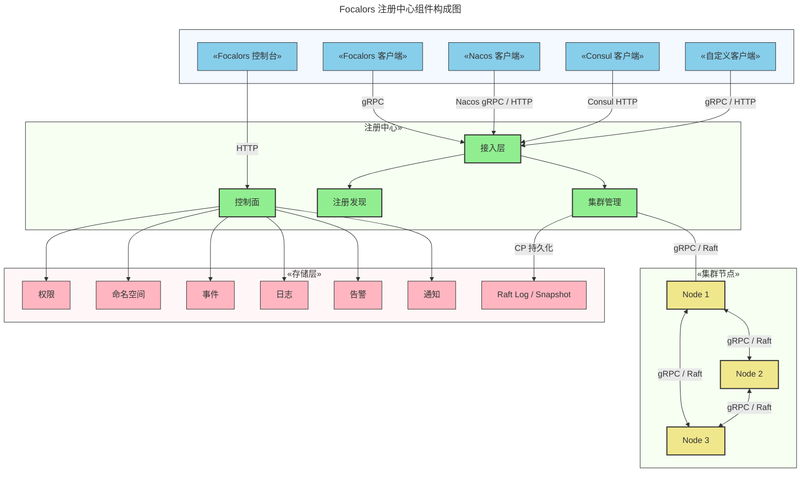
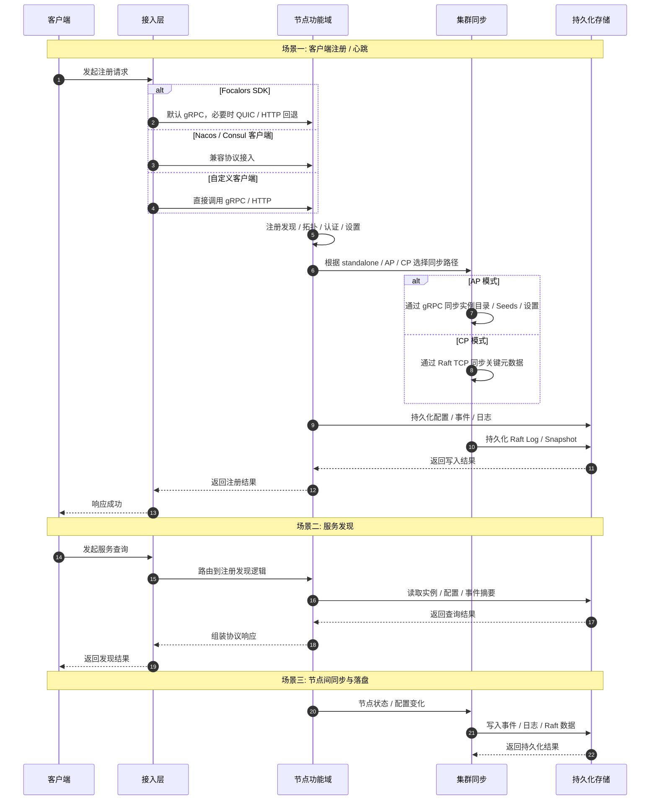

# 芙卡洛斯

[English](README.md) | 中文

Focalors（芙卡洛斯）是一个面向生产环境的服务注册中心，提供服务注册、服务发现、健康检查、拓扑和治理能力。它聚焦“注册中心”这一长期稳定的产品边界，用于替代 Nacos / Consul 在注册发现场景下的核心能力，而不引入配置中心、Service Mesh、KV 等额外负担。

## 文档指南

📚 如果你想快速了解项目，建议按下面的顺序阅读:

- [系统架构](./docs/architecture_zh-CN.md)
- [部署指南](./docs/deployment_zh-CN.md)
- [集成指南](./docs/integration_zh-CN.md)

## 产品定位

Focalors 的目标不是做一个更宽泛的平台，而是把注册中心本身应该负责的事情做完整: 实例注册、服务发现、健康控制、依赖拓扑、运行治理，以及在 AP / CP 场景下的集群协同。对于 Go 团队，它提供收敛的原生接入边界；对于存量系统，它提供 Nacos / Consul 兼容路径，降低迁移成本。

| 维度 | Focalors | Nacos | Consul |
| --- | --- | --- | --- |
| 产品边界 | 注册中心控制面 | 注册、配置、服务管理平台 | Service Networking 平台 |
| 主要定位 | 注册发现、治理、拓扑 | Naming + Config + 管理 | Discovery + Mesh + Traffic |
| 运行时依赖 | 原生 Go 进程 | Java 运行时 | 原生二进制 |
| 一致性模式 | `standalone`、`cluster + ap`、`cluster + cp` | Standalone / Cluster | 以 Raft 控制面为核心 |
| 推荐 Go 接入 | [`pkg/sdk`](./pkg/sdk) | Nacos 客户端生态 | HTTP / DNS / Agent / SDK |
| 兼容迁移角色 | 原生目标系统 | 常见迁移来源 | 常见迁移来源 |
| 长期 API 边界 | 原生 SDK + 原生 HTTP/gRPC | Naming / Config API | HTTP / Agent / DNS / Mesh |

适合使用 Focalors 的典型场景:

- 目标需求就是注册中心，不希望顺带引入配置中心或 Mesh。
- 团队以 Go 为主，希望长期维护的接入边界更简单。
- 同一产品需要覆盖可用性优先和一致性优先两类场景。
- 希望从 Nacos / Consul 迁移，但不把兼容协议长期保留为核心抽象。

## 核心特性

- 服务注册与发现: 提供实例注册、注销、心跳续约、健康筛选、服务列表与实例列表查询。
- 服务拓扑: 支持服务依赖关系上报、聚合与查询，便于梳理调用关系。
- 多协议接入: 支持原生 gRPC、HTTP、QUIC，以及 Nacos / Consul 兼容接入。
- 多模式运行: 支持 `standalone`、`cluster + ap`、`cluster + cp` 三种运行模式。
- 集群协同: AP 模式基于 gRPC 同步目录状态，CP 模式基于 Raft 复制关键元数据。
- 控制面能力: 提供认证、用户、API Key、权限、系统设置和集群管理接口。
- 告警与通知: 提供事件评估、告警规则和通知投递能力。
- 存储策略: 事件与指标支持 `memory` / `persistent` 切换，便于在本地验证和生产持久化之间调整。

## 组件构成

### 整体架构



- `接入层`：统一承接 gRPC、HTTP、QUIC 以及 Nacos / Consul 兼容请求，负责协议适配和请求路由。
- `注册发现`：负责实例注册、服务发现、健康状态、命名空间和服务拓扑等核心目录能力。
- `控制面`：负责认证、权限、系统设置、告警与通知等管理能力。
- `集群运行时`：负责 AP 模式下的 gRPC 复制与 CP 模式下的 Raft 共识。
- `集群节点`：代表实际运行中的多个注册中心节点，节点之间通过 AP / CP 两套机制互联。
- `持久化存储`：负责承接配置、事件、日志以及 CP 模式下的 Raft 日志与快照。

## 运行流程



## 部署模式

| 模式 | 说明 | 适用场景 |
| --- | --- | --- |
| `standalone` | 单进程运行 | 本地开发、测试环境、快速验证 |
| `cluster + ap` | 可用性优先的集群模式 | 更强调可用性和运维灵活性的生产环境 |
| `cluster + cp` | 一致性优先的集群模式 | 更强调元数据一致性和 Leader 写入约束的生产环境 |

### 如何部署

#### 1. 本地单节点

适合开发和验证，推荐配置:

```yaml
mode: "standalone"
consistency: "ap"
server:
  http: ":8500"
  grpc: "auto"
  quic: "off"
  raft: "off"
```

启动命令:

```bash
go run ./cmd/server/main.go -config configs/config.yaml.example
```

#### 2. AP 集群

适合高可用场景，节点间通过 gRPC 同步目录状态和 Seeds 信息。推荐配置:

```yaml
mode: "cluster"
consistency: "ap"
server:
  http: ":8500"
  grpc: "auto"
  quic: "off"
  raft: "off"
```

部署要点:

- 每个节点需要独立 `node_id` 和 `data_dir`
- 节点成员与 Seeds 通过控制面维护
- 更适合可用性优先、允许最终一致的场景

#### 3. CP 集群

适合强一致元数据场景，节点间通过 Raft TCP 共识同步关键写入。

首个节点:

```yaml
mode: "cluster"
consistency: "cp"
bootstrap: true
server:
  http: ":8500"
  grpc: ":9000"
  raft: "127.0.0.1:7000"
```

后续节点:

```yaml
mode: "cluster"
consistency: "cp"
bootstrap: false
server:
  http: ":8501"
  grpc: ":9001"
  raft: "127.0.0.1:7001"
```

部署要点:

- 首个节点必须设置 `bootstrap: true`
- 每个节点都要配置明确可达的 `raft` 地址
- 更适合一致性优先、要求 Leader 写入约束的场景

## 客户端集成

### 支持方式

- Focalors SDK 集成: 推荐给 Go 服务，默认通过 `pkg/sdk + gRPC` 接入，适合作为长期标准方式。
- 兼容 Nacos API 接入: 适合现网使用 Nacos Naming 的系统迁移，目标是尽量少改业务代码。
- 兼容 Consul API 接入: 适合现网使用 Consul HTTP / SDK 的系统迁移，保留原有调用模型。
- 自定义 gRPC / HTTP 接入: 适合外部项目直接基于公开协议对接，不依赖仓库内部实现。

相关示例:

- [Focalors 集成示例](./examples/service-discovery/native/README.md)
- [Consul 迁移示例](./examples/service-discovery/consul/README.md)
- [Nacos 迁移示例](./examples/service-discovery/nacos/README.md)
- [自定义协议示例](./examples/service-discovery/custom/README.md)

## 目录结构

| 路径 | 职责 |
| --- | --- |
| `cmd/server` | 服务端启动入口与运行时装配 |
| `internal/catalog` | 注册、发现、生命周期、拓扑 |
| `internal/cluster` | AP / CP 运行时与集群行为 |
| `internal/transport/http` | 原生 HTTP 控制接口 |
| `internal/transport/rpc` | gRPC 服务接口 |
| `internal/transport/quic` | QUIC 监听入口 |
| `internal/adapter` | Nacos / Consul 兼容适配层 |
| `internal/auth` | 控制台认证、用户、API Key |
| `internal/settings` | 运行时设置与系统控制 |
| `internal/alert` | 事件评估与告警策略 |
| `internal/notify` | 通知投递 |
| `pkg/sdk` | 对外 Go SDK |
| `api/proto` | protobuf 协议定义 |
| `examples` | 接入与迁移示例 |
| `docs` | 架构、部署、集成文档 |

## 如何启动

### 快速体验

在项目根目录执行:

```bash
go run ./cmd/server/main.go
```

默认 API 地址:

```text
http://127.0.0.1:8500
```

如果你希望显式指定配置文件，可以执行:

```bash
go run ./cmd/server/main.go -config configs/config.yaml.example
```

### 运行测试

在项目根目录执行:

```bash
go test ./...
```

## 相关文档

- [文档索引](./docs/README-zh-CN.md)
- [系统架构](./docs/architecture_zh-CN.md)
- [部署指南](./docs/deployment_zh-CN.md)
- [集成指南](./docs/integration_zh-CN.md)

## 📄 许可证

本项目采用 Apache License 2.0 许可证。详情请参阅 [LICENSE](LICENSE) 文件。
