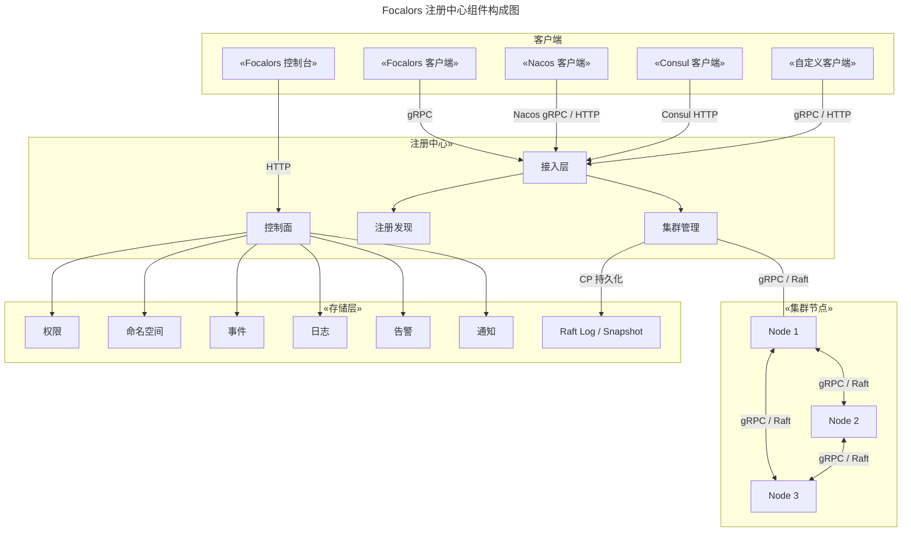
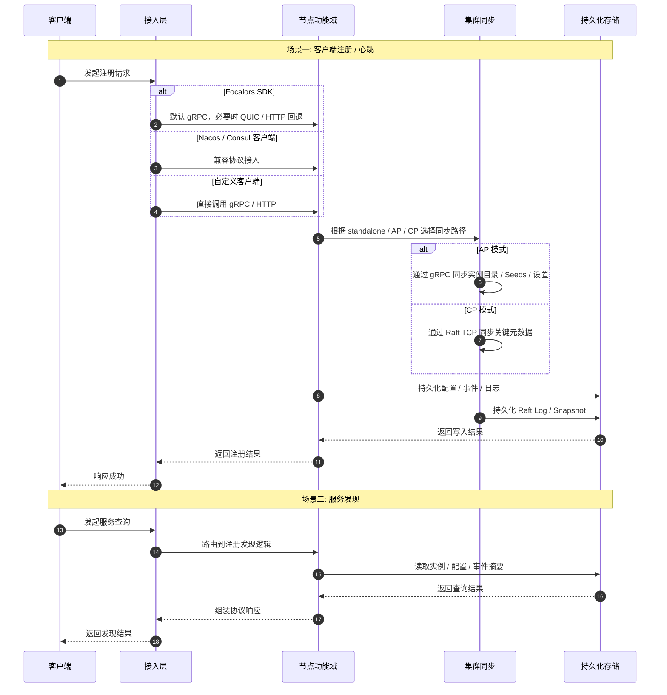

# 芙卡洛斯

[English](README.md) | 中文

Focalors（芙卡洛斯）是一个面向生产环境的轻量化服务注册中心，聚焦注册、发现、健康检查、拓扑和治理，主要面向只需要注册中心能力、不希望额外引入配置中心或 Service Mesh、或运行在内存受限环境中的系统。

## 产品定位

Focalors 面向“只需要注册中心”的场景，覆盖注册、发现、健康控制、拓扑、治理与 AP / CP 集群协同，支持无缝接入 Nacos / Consul API。

| 功能点 | Focalors | Nacos | Consul |
| --- | --- | --- | --- |
| 服务注册与发现 | ✓ | ✓ | ✓ |
| 服务健康检查 | ✓ | ✓ | ✓ |
| 服务上下线 | ✓ | ✓ | ✓ |
| 服务依赖拓扑 | ✓ | ✗ | ✗ |
| AP 一致性 | ✓ | ✓ | ✗ |
| CP 一致性 | ✓ | ✗ | ✓ |
| AP/CP 切换 | ✓ | ✗ | ✗ |
| RBAC 控制 | ✓ | ✓ | ✓ |
| 命名空间隔离 | ✓ | ✓ | ✓（收费） |
| 弱网传输 | ✓ | ✗ | ✗ |
| 事件存储 | ✓ | ✗ | ✗ |
| 内存占用 | 低 | 高 | 中 |

## 整体架构



- `接入层`：负责协议适配和请求路由，支持 gRPC、HTTP、QUIC，兼容 Nacos / Consul 请求。
- `注册发现`：负责实例注册、服务发现、健康状态、命名空间与拓扑能力。
- `集群管理`：负责 AP 模式下的 gRPC 复制与 CP 模式下的 Raft 共识。
- `控制面`：负责认证、权限、系统设置、告警与通知。
- `存储层`：负责事件、日志和 CP 模式下的 Raft 日志与快照。

## 运行流程



## 快速启动

启动服务端：

```bash
go run ./cmd/server/main.go
```

默认 API 地址：

```text
http://127.0.0.1:8500
```

显式指定配置：

```bash
go run ./cmd/server/main.go -config config/config.yaml.example
```

运行测试：

```bash
go test ./...
```

## 部署模式

| 模式 | 关键配置 | 适用场景 |
| --- | --- | --- |
| `standalone` | `mode: "standalone"` | 本地开发、测试环境、快速验证 |
| `cluster + ap` | `mode: "cluster"` + `consistency: "ap"` | 可用性优先、允许最终一致的生产环境 |
| `cluster + cp` | `mode: "cluster"` + `consistency: "cp"` | 一致性优先、要求 Leader 写入约束的生产环境 |

单节点示例：

```yaml
mode: "standalone"
consistency: "ap"
server:
  http: ":8500"
  grpc: "auto"
  quic: "off"
  raft: "off"
```

AP 集群示例：

```yaml
mode: "cluster"
consistency: "ap"
server:
  http: ":8500"
  grpc: "auto"
  quic: "off"
  raft: "off"
```

CP 集群示例：

```yaml
mode: "cluster"
consistency: "cp"
bootstrap: true
server:
  http: ":8500"
  grpc: ":9000"
  raft: "127.0.0.1:7000"
```

详细部署说明见 [部署指南](./docs/deployment_zh-CN.md)。

## 客户端集成

- Focalors SDK：面向 Go 服务，推荐作为长期标准接入。
  对应示例：[Focalors 集成示例](./examples/service-discovery/native/README.md)
- Nacos 兼容：面向 Nacos Naming 存量系统，尽量少改业务代码。
  对应示例：[Nacos 迁移示例](./examples/service-discovery/nacos/README.md)
- Consul 兼容：面向 Consul HTTP / SDK 存量系统，保留原有调用模型。
  对应示例：[Consul 迁移示例](./examples/service-discovery/consul/README.md)
- 自定义 gRPC / HTTP：面向外部项目，直接对接公开协议。
  对应示例：[自定义协议示例](./examples/service-discovery/custom/README.md)

## 开发说明

开发时先判断变更落在哪一层，再进入对应目录。

| 开发任务 | 入口目录 |
| --- | --- |
| 服务端启动与运行时装配 | `cmd/server` |
| 注册、发现、健康、拓扑核心逻辑 | `internal/catalog` |
| AP / CP 集群运行时 | `internal/cluster` |
| HTTP / gRPC / QUIC 接口 | `internal/transport` |
| Nacos / Consul 兼容适配 | `internal/adapter` |
| 认证、权限、系统设置 | `internal/auth`、`internal/settings` |
| 告警与通知 | `internal/alert`、`internal/notify` |
| 对外 Go SDK | `pkg/sdk` |
| 协议定义 | `api/proto` |
| 接入与迁移验证 | `examples` |

目录结构图：

```text
eden-registry
├─ cmd
│  └─ server                 # 服务端启动入口与运行时装配
├─ api
│  └─ proto                  # gRPC / protobuf 协议定义
├─ internal
│  ├─ catalog                # 注册、发现、健康、拓扑核心逻辑
│  ├─ cluster                # AP / CP 集群运行时
│  ├─ transport
│  │  ├─ http                # 原生 HTTP 接口
│  │  ├─ rpc                 # gRPC 接口
│  │  └─ quic                # QUIC 传输入口
│  ├─ adapter                # Nacos / Consul 兼容适配层
│  ├─ auth                   # 认证、用户、API Key
│  ├─ settings               # 系统设置与运行时控制
│  ├─ alert                  # 告警规则与事件评估
│  └─ notify                 # 通知发送
├─ pkg
│  └─ sdk                    # 对外 Go SDK
├─ examples                  # 接入与迁移示例
└─ docs                      # 架构、部署、集成文档
```

常用开发命令：

```bash
go run ./cmd/server/main.go
go run ./cmd/server/main.go -config config/config.yaml.example
go test ./...
```

开发建议：

- 改注册发现行为，优先看 `internal/catalog`，不要先从兼容层改起。
- 改 AP / CP 一致性或节点协同，优先看 `internal/cluster`。
- 改外部协议，原生接口看 `internal/transport`，兼容接口看 `internal/adapter`。
- 改 SDK 或接入体验时，同时检查 `pkg/sdk` 和 `examples`，确保示例与 SDK 保持一致。

## 文档索引

- [系统架构](./docs/architecture_zh-CN.md)
- [部署指南](./docs/deployment_zh-CN.md)
- [集成指南](./docs/integration_zh-CN.md)

## 📄 许可证

本项目采用 Apache License 2.0 许可证。详情请参阅 [LICENSE](LICENSE) 文件。
