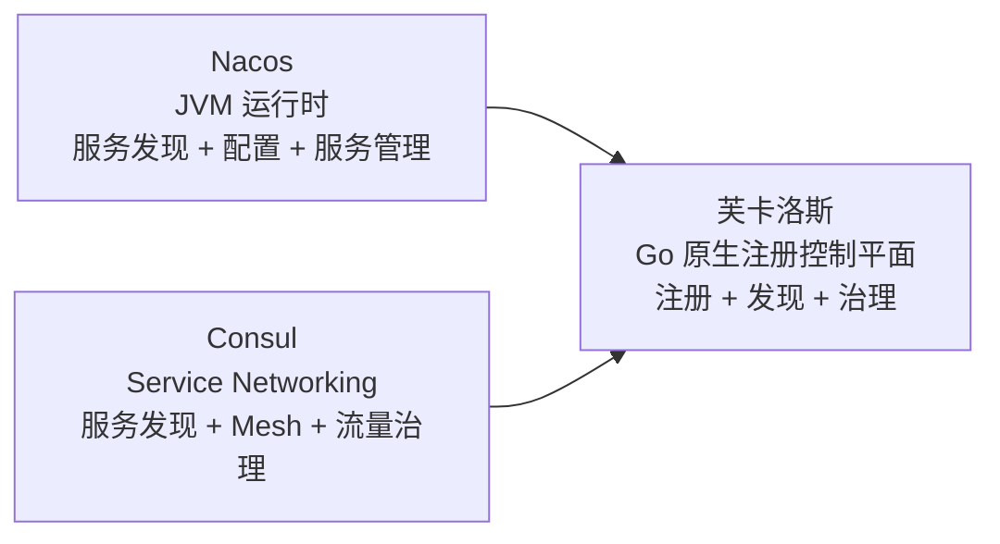
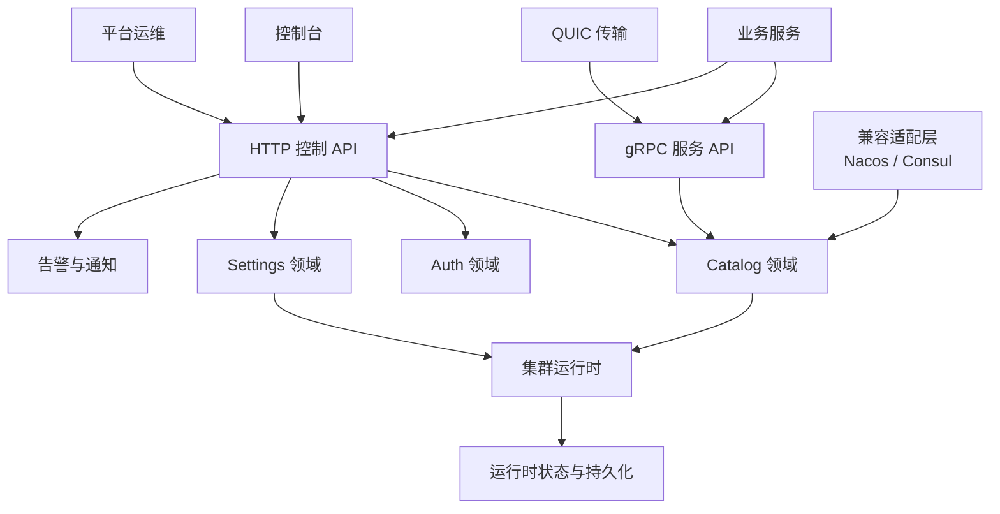

# 芙卡洛斯

[English](README.md) | 中文

芙卡洛斯是一个企业级服务注册控制平面，目标很明确: 在保留注册、发现、健康检查、拓扑和治理能力的前提下，替代只做注册中心时并不经济的 Nacos 和 Consul 组合。

它不把配置中心、Service Mesh、KV 或更宽的网络编排能力绑定为核心前提，而是把系统边界收敛到注册中心真正需要长期稳定演进的部分:

- 服务注册与发现
- 健康检查与实例生命周期控制
- 服务依赖拓扑
- 运行时治理
- `standalone`、`cluster + ap`、`cluster + cp` 三种运行模式
- 事件存储与指标存储的持久化 / 内存切换

对 Go 服务，推荐的对外接入面只有 [`pkg/sdk`](./pkg/sdk)。Nacos 和 Consul 兼容接口只用于迁移，不作为长期 API 边界。

## 对比

### 范围对比图



### 对比矩阵

| 维度 | 芙卡洛斯 | Nacos | Consul |
| --- | --- | --- | --- |
| 产品定位 | 企业级注册控制平面 | 服务发现 + 配置 + 服务管理平台 | Service Networking 平台 |
| 运行时依赖 | 原生 Go 进程 | Java 运行时 | 原生二进制 |
| 官方部署起点 | 单进程即可启动 | 官方文档要求 Java；源码构建路径需要 Maven | 官方采用 Server / Agent 架构 |
| 官方资源提示 | 无 JVM 基线要求 | 官方建议至少 `2 CPU / 4 GB RAM / 60 GB Disk` | 官方要求按工作集估算，并为 Server 预留 `2x-4x` 工作集内存 |
| 核心能力边界 | 注册、发现、健康、拓扑、治理 | 注册、配置、管理一体化 | 注册、发现、Mesh、流量治理、网络自动化 |
| 一致性运行模式 | `standalone`、`cluster + ap`、`cluster + cp` | 提供单机、集群、多集群部署模型 | 以 Raft 控制平面为核心，围绕服务网络运行 |
| 存储切换 | 事件存储、指标存储支持持久化 / 内存切换 | 面向 Nacos 自身存储模型 | 面向 Consul Catalog / KV / Raft 存储模型 |
| Go 接入策略 | 一个推荐 SDK: [`pkg/sdk`](./pkg/sdk) | 依赖 Nacos 客户端生态 | HTTP API、DNS、Agent、Mesh 等多入口 |
| 迁移策略 | 原生模型为主，兼容层为辅 | 常作为迁移来源 | 常作为迁移来源 |
| 商业边界 | 核心注册能力不依赖企业版拆分 | 取决于具体生态与部署形态 | 官方明确区分 CE 与 Enterprise |

### 芙卡洛斯的优势

- 如果目标只是注册中心，芙卡洛斯比 Nacos 更少平台依赖。Nacos 官方快速开始明确要求 Java，较新的快速开始还给出至少 `4 GB RAM` 的建议。
- 如果目标只是注册中心，芙卡洛斯比 Consul 更聚焦。Consul 官方将自己定义为 service networking 方案，除了注册发现，还覆盖 Mesh、流量治理、网关和网络自动化。
- 对 Go 团队，芙卡洛斯把长期接入边界收敛到 [`pkg/sdk`](./pkg/sdk)，不会把外部项目长期绑定在 Nacos Naming 模型或 Consul Agent / DNS / HTTP 多入口模型上。
- 芙卡洛斯原生提供 `AP` / `CP` 切换。这意味着同一套系统可以在“优先可用性”和“优先元数据一致性”之间切换，而不是通过更换产品来切换分布式模型。
- 芙卡洛斯把事件存储、指标存储做成可切换的运行时能力，便于在“开发环境轻量运行”和“生产环境持久化保留”之间平滑切换。

## 核心能力

- 原生服务注册与发现
- 健康信号与实例生命周期控制
- 依赖拓扑上报
- HTTP API、gRPC API、QUIC 传输支持
- `standalone`、`cluster + ap`、`cluster + cp` 运行模式
- 事件存储与指标存储的运行时切换
- 控制台认证、API Key、RBAC 风格管理能力
- 告警与通知集成
- Nacos / Consul 兼容适配，用于迁移

## 架构总览



## 部署模式

| 模式 | 适用场景 |
| --- | --- |
| `standalone + ap` | 本地开发、隔离环境、快速验证 |
| `cluster + ap` | 企业生产环境中更看重可用性和运维灵活性 |
| `cluster + cp` | 企业生产环境中要求更强元数据一致性和 Leader 写入约束 |

## 接入策略

### 推荐路径

- Go 服务通过 [`pkg/sdk`](./pkg/sdk) 接入

### 支持路径

- 原生 HTTP API
- 原生 gRPC API
- Nacos 兼容适配
- Consul 兼容适配

### 战略方向

- 适配层用于迁移
- 原生 API 用于标准化
- 不再让 Nacos / Consul 成为长期抽象边界

## 仓库结构

| 路径 | 职责 |
| --- | --- |
| `cmd/server` | 服务端启动与运行时装配 |
| `internal/catalog` | 注册、发现、生命周期、拓扑 |
| `internal/cluster` | AP / CP 运行时与集群行为 |
| `internal/transport/http` | 原生 HTTP 控制 API |
| `internal/transport/rpc` | gRPC 服务接口 |
| `internal/transport/quic` | QUIC 监听入口 |
| `internal/adapter` | 兼容适配层，包括 Nacos 和 Consul |
| `internal/auth` | 控制台认证、用户、API Key |
| `internal/settings` | 运行时设置与系统控制 |
| `internal/alert` | 事件评估与告警策略 |
| `internal/notify` | 通知投递 |
| `pkg/sdk` | 对外 Go SDK |
| `api/proto` | protobuf 协议 |
| `examples` | 接入与迁移示例 |
| `docs` | 架构、部署、集成文档 |

## 快速开始

启动服务端：

```bash
go run ./cmd/server/main.go
```

显式指定配置：

```bash
go run ./cmd/server/main.go -config configs/config.yaml.example
```

默认 API 地址：

```text
http://127.0.0.1:8500
```

运行后端测试：

```bash
go test ./...
```

## 示例

- [服务发现总览](./examples/service-discovery/README.md)
- [原生接入示例](./examples/service-discovery/native/README.md)
- [Consul 迁移示例](./examples/service-discovery/consul/README.md)
- [Nacos 迁移示例](./examples/service-discovery/nacos/README.md)
- [自定义协议示例](./examples/service-discovery/custom/README.md)

## 文档

- [文档索引](./docs/README-zh-CN.md)
- [系统架构](./docs/architecture_zh-CN.md)
- [部署指南](./docs/deployment_zh-CN.md)
- [集成指南](./docs/integration_zh-CN.md)
- [English README](./README.md)

## 外部参考

上面的对比基于公开官方文档和当前仓库实现边界整理而来：

- Nacos 快速开始明确要求 Java 运行时，并给出推荐资源基线：https://nacos.io/en/docs/next/quickstart/quick-start/
- Nacos 部署文档给出 `2 CPU / 4 GB RAM` 级别的推荐环境：https://nacos.io/en-us/docs/deployment.html
- Consul 官方定位为包含发现、Mesh、流量管理、网络自动化的 service networking 产品：https://developer.hashicorp.com/consul/docs/intro
- Consul Server 资源规划文档要求按工作集估算内存，并预留 `2x-4x` 工作集空间：https://developer.hashicorp.com/consul/docs/reference/architecture/server
- Consul Community / Enterprise 能力分层：https://developer.hashicorp.com/consul/docs/fundamentals/editions

## 📄 许可证

本项目采用 Apache License 2.0 许可证。详情请参阅 [LICENSE](LICENSE) 文件。
