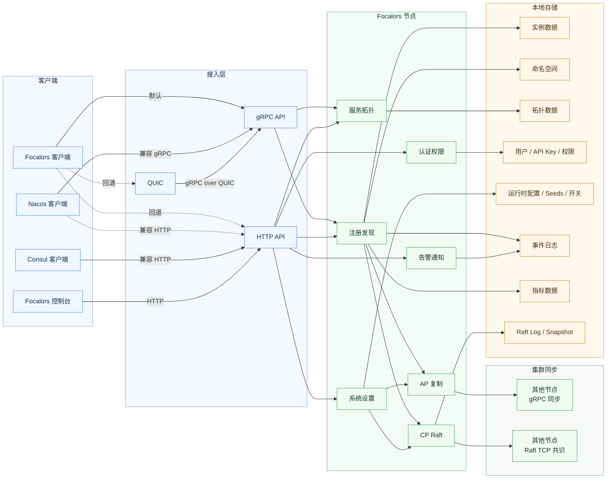

# 芙卡洛斯

[English](README.md) | 中文

Focalors（芙卡洛斯）是一个面向生产环境的服务注册中心，提供服务注册、服务发现、健康检查、拓扑和治理能力。

它用于替代 Nacos 和 Consul 在“只需要注册中心”场景下的那部分能力，去掉配置中心、Service Mesh、KV 等非核心负担，保留更稳定、更直接的服务治理能力。

## 对比

面向“注册中心”场景，下面的表格使用 `✅`、`💰`、`❌` 三种标记，直接说明各产品的能力覆盖和商业边界。

| 功能 | Focalors | Nacos | Consul |
| --- | --- | --- | --- |
| 服务注册 | ✅ | ✅ | ✅ |
| 服务发现 | ✅ | ✅ | ✅ |
| 健康检查 | ✅ | ✅ | ✅ |
| 实例管理 | ✅ | ✅ | ✅ |
| 服务依赖拓扑 | ✅ | ❌ | ❌ |
| 命名空间隔离 | ✅ | ✅ | 💰 |
| AP 一致性 | ✅ | ✅ | ❌ |
| CP 一致性 | ✅ | ✅ | ✅ |
| 控制台认证 | ✅ | ✅ | ✅ |
| RBAC 权限控制 | ✅ | ✅ | ✅ |
| 告警与通知集成 | ✅ | ❌ | ❌ |
| 事件存储 | ✅ | ❌ | ❌ |
| 内存占用 | 🟢低 | 🔴高 | 🟡中 |

## 核心能力

- 服务注册与发现
  管理服务实例注册、发现、心跳、健康状态和实例生命周期。
- 命名空间与服务拓扑
  支持命名空间隔离、服务依赖拓扑上报和拓扑查询。
- 多模式集群运行
  支持 `standalone`、`cluster + ap`、`cluster + cp`，可根据场景在可用性优先和一致性优先之间切换。
- 多协议接入
  业务服务可通过 Go SDK、HTTP、gRPC 接入，QUIC 作为弱网场景下的 gRPC 传输补充。
- 控制台与权限体系
  提供控制台认证、用户、API Key、RBAC 风格权限控制和系统设置管理。
- 事件、指标与告警
  内置事件日志、运行指标采集、告警与通知能力，支持持久化 / 内存模式切换。
- 迁移兼容
  提供 Nacos / Consul 兼容接口，便于从现有注册中心平滑迁移。

## 架构总览



## 部署模式

| 模式 | 适用场景 |
| --- | --- |
| `standalone` | 本地开发、隔离环境、快速验证 |
| `cluster + ap` | 企业生产环境中更看重可用性和运维灵活性 |
| `cluster + cp` | 企业生产环境中要求更强元数据一致性和 Leader 写入约束 |

## 接入与迁移

- 推荐接入方式: Go 服务通过 [`pkg/sdk`](./pkg/sdk) 接入。
- 支持的协议与接口: HTTP API、gRPC API、QUIC。
- 兼容迁移路径: 提供 Nacos / Consul 兼容接口，用于平滑迁移现有系统。
- 长期建议: 新系统优先使用 Focalors 原生接口，兼容接口主要用于迁移。

相关示例:

- [服务发现总览](./examples/service-discovery/README.md)
- [原生接入示例](./examples/service-discovery/native/README.md)
- [Consul 迁移示例](./examples/service-discovery/consul/README.md)
- [Nacos 迁移示例](./examples/service-discovery/nacos/README.md)
- [自定义协议示例](./examples/service-discovery/custom/README.md)

## 仓库结构

| 路径 | 职责 |
| --- | --- |
| `cmd/server` | 服务端启动与运行时装配 |
| `internal/catalog` | 注册、发现、生命周期、拓扑 |
| `internal/cluster` | AP / CP 运行时与集群行为 |
| `internal/transport/http` | 原生 HTTP 控制 API |
| `internal/transport/rpc` | gRPC 服务接口 |
| `internal/transport/quic` | QUIC 监听入口 |
| `internal/adapter` | 兼容适配层，包括 Nacos 和 Consul |
| `internal/auth` | 控制台认证、用户、API Key |
| `internal/settings` | 运行时设置与系统控制 |
| `internal/alert` | 事件评估与告警策略 |
| `internal/notify` | 通知投递 |
| `pkg/sdk` | 对外 Go SDK |
| `api/proto` | protobuf 协议 |
| `examples` | 接入与迁移示例 |
| `docs` | 架构、部署、集成文档 |

## 快速开始

启动服务端：

```bash
go run ./cmd/server/main.go
```

显式指定配置：

```bash
go run ./cmd/server/main.go -config configs/config.yaml.example
```

默认 API 地址：

```text
http://127.0.0.1:8500
```

运行后端测试：

```bash
go test ./...
```

## 文档

- [文档索引](./docs/README-zh-CN.md)
- [系统架构](./docs/architecture_zh-CN.md)
- [部署指南](./docs/deployment_zh-CN.md)
- [集成指南](./docs/integration_zh-CN.md)
- [English README](./README.md)

## 外部参考

上面的对比基于公开官方文档和当前仓库实现边界整理而来：

- Nacos 快速开始明确要求 Java 运行时，并给出推荐资源基线：https://nacos.io/en/docs/next/quickstart/quick-start/
- Nacos 部署文档给出 `2 CPU / 4 GB RAM` 级别的推荐环境：https://nacos.io/en-us/docs/deployment.html
- Consul 官方定位为包含发现、Mesh、流量管理、网络自动化的 service networking 产品：https://developer.hashicorp.com/consul/docs/intro
- Consul Server 资源规划文档要求按工作集估算内存，并预留 `2x-4x` 工作集空间：https://developer.hashicorp.com/consul/docs/reference/architecture/server
- Consul Community / Enterprise 能力分层：https://developer.hashicorp.com/consul/docs/fundamentals/editions

## 📄 许可证

本项目采用 Apache License 2.0 许可证。详情请参阅 [LICENSE](LICENSE) 文件。
