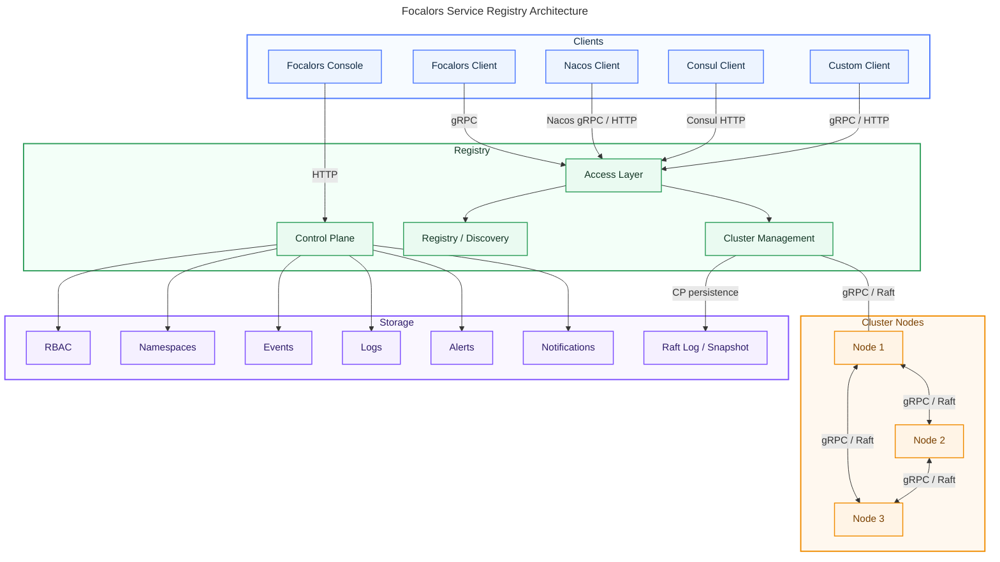
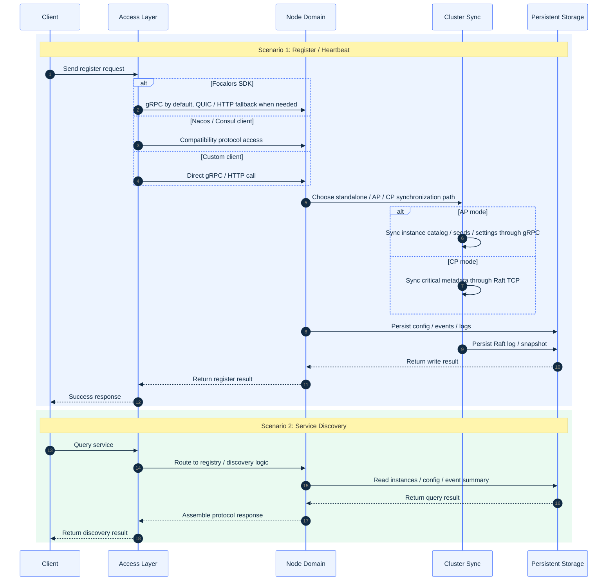

# Focalors

English | [中文](README-zh-CN.md)

Focalors is a lightweight service registry for production environments. It focuses on registration, discovery, health checks, topology, and governance, and is intended for systems that only need registry capabilities, do not want to introduce a configuration center or service mesh, or run in memory-constrained environments.

## Demo Screenshots

Services


Topology


Clusters


Settings


## Product Positioning

Focalors targets registry-only scenarios. It covers registration, discovery, health control, topology, governance, and AP / CP cluster coordination while remaining compatible with Nacos and Consul APIs.

<table>
  <tr>
    <td valign="top" width="62%">
      <strong>Capability Comparison</strong>
      <table>
        <tr>
          <th>Capability</th>
          <th>Focalors</th>
          <th>Nacos</th>
          <th>Consul</th>
        </tr>
        <tr>
          <td>Service registration and discovery</td>
          <td>✓</td>
          <td>✓</td>
          <td>✓</td>
        </tr>
        <tr>
          <td>Service health checks</td>
          <td>✓</td>
          <td>✓</td>
          <td>✓</td>
        </tr>
        <tr>
          <td>Instance online / offline control</td>
          <td>✓</td>
          <td>✓</td>
          <td>✓</td>
        </tr>
        <tr>
          <td>Service dependency topology</td>
          <td>✓</td>
          <td>✗</td>
          <td>✗</td>
        </tr>
        <tr>
          <td>AP consistency</td>
          <td>✓</td>
          <td>✓</td>
          <td>✗</td>
        </tr>
        <tr>
          <td>CP consistency</td>
          <td>✓</td>
          <td>✗</td>
          <td>✓</td>
        </tr>
        <tr>
          <td>AP / CP switching</td>
          <td>✓</td>
          <td>✗</td>
          <td>✗</td>
        </tr>
        <tr>
          <td>RBAC control</td>
          <td>✓</td>
          <td>✓</td>
          <td>✓</td>
        </tr>
        <tr>
          <td>Namespace isolation</td>
          <td>✓</td>
          <td>✓</td>
          <td>✓ (paid)</td>
        </tr>
        <tr>
          <td>Weak-network transport</td>
          <td>✓</td>
          <td>✗</td>
          <td>✗</td>
        </tr>
        <tr>
          <td>Event storage</td>
          <td>✓</td>
          <td>✗</td>
          <td>✗</td>
        </tr>
        <tr>
          <td>Memory footprint</td>
          <td>Low</td>
          <td>High</td>
          <td>Medium</td>
        </tr>
      </table>
    </td>
    <td valign="top" width="38%">
      <strong>Applicable Scenarios</strong>
      <ul>
        <li>Registry-only deployments without a separate configuration center or service mesh.</li>
        <li>Environments that need both <code>AP</code> high availability and <code>CP</code> consistency management in one runtime.</li>
        <li>Memory-constrained deployments with a runtime budget below <code>100MB</code>.</li>
      </ul>
    </td>
  </tr>
</table>

## Architecture / Runtime Flow

### Architecture



- `Access Layer`: protocol adaptation and request routing for gRPC, HTTP, QUIC, and Nacos / Consul compatibility.
- `Registry / Discovery`: service registration, discovery, health state, namespaces, and topology.
- `Cluster Management`: gRPC replication in AP mode and Raft consensus in CP mode.
- `Control Plane`: authentication, authorization, settings, alerts, and notifications.
- `Storage`: events, logs, and Raft log / snapshot persistence in CP mode.

### Runtime Flow



## Quick Start

Start the server:

```bash
go run ./cmd/server/main.go
```

Default API address:

```text
http://127.0.0.1:8500
```

Specify a configuration file explicitly:

```bash
go run ./cmd/server/main.go -config config/config.yaml.example
```

Run tests:

```bash
go test ./...
```

## Deployment Modes

| Mode | Key configuration | Best fit |
| --- | --- | --- |
| Standalone | `mode: "standalone"` | local development, testing, fast validation |
| Cluster + AP | `mode: "cluster"` + `consistency: "ap"` | availability-first production environments |
| Cluster + CP | `mode: "cluster"` + `consistency: "cp"` | consistency-first production environments with leader-based writes |

Standalone example:

```yaml
mode: "standalone"
consistency: "ap"
server:
  http: ":8500"
  grpc: "auto"
  quic: "off"
  raft: "off"
```

`grpc: "auto"` selects the first available port in the `9000-9999` range, so a local single-node startup uses `127.0.0.1:9000` unless that port is already occupied.

AP cluster example:

```yaml
mode: "cluster"
consistency: "ap"
server:
  http: ":8500"
  grpc: "auto"
  quic: "off"
  raft: "off"
```

When multiple AP nodes run on the same host, `grpc: "auto"` continues through `9000-9999`, typically producing `:9000`, `:9001`, `:9002`, and so on.

CP cluster example:

```yaml
mode: "cluster"
consistency: "cp"
bootstrap: true
server:
  http: ":8500"
  grpc: ":9000"
  raft: "127.0.0.1:7000"
```

For full deployment details, see [Deployment Guide](./docs/deployment.md).

## Client Integration

| Integration path | Best fit | Example |
| --- | --- | --- |
| Focalors SDK | Go services, primary integration path | [Native integration example](./examples/service-discovery/native/README.md) |
| Nacos compatibility | Existing Nacos Naming systems with minimal business code changes | [Nacos migration example](./examples/service-discovery/nacos/README.md) |
| Consul compatibility | Existing Consul HTTP / SDK systems while keeping the original call model | [Consul migration example](./examples/service-discovery/consul/README.md) |
| Custom gRPC / HTTP | External systems that integrate directly through public protocols | [Custom protocol example](./examples/service-discovery/custom/README.md) |

## Development Guide

### Repository Structure

```text
eden-registry
├─ cmd
│  └─ server                 # server bootstrap and runtime composition
├─ api
│  └─ proto                  # gRPC / protobuf contracts
├─ internal
│  ├─ catalog                # registration, discovery, health, topology core logic
│  ├─ cluster                # AP / CP cluster runtime
│  ├─ transport
│  │  ├─ http                # native HTTP interfaces
│  │  ├─ rpc                 # gRPC interfaces
│  │  └─ quic                # QUIC transport entry
│  ├─ adapter                # Nacos / Consul compatibility adapters
│  ├─ auth                   # authentication, users, API keys
│  ├─ settings               # system settings and runtime control
│  ├─ alert                  # alert rules and event evaluation
│  └─ notify                 # notification delivery
├─ pkg
│  └─ sdk                    # public Go SDK
├─ examples                  # integration and migration examples
└─ docs                      # architecture, deployment, and integration docs
```

### Common Commands

```bash
go run ./cmd/server/main.go
go run ./cmd/server/main.go -config config/config.yaml.example
go test ./...
```

### Maintenance Guidelines

- Follow single-responsibility boundaries. Keep registration and discovery in `internal/catalog`, and keep cluster node logic in `internal/cluster`.
- Keep Nacos and Consul compatibility work in `internal/adapter`, and keep native protocol work in `internal/transport`.
- When changing the SDK or examples, update `pkg/sdk`, `examples`, and the docs together.

## Documentation

- [Architecture](./docs/architecture.md)
- [Deployment](./docs/deployment.md)
- [Integration](./docs/integration.md)

## 📄 License

This project is licensed under the Apache License 2.0. See the [LICENSE](LICENSE) file for details.
