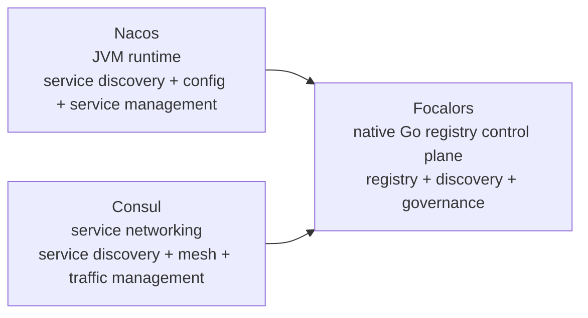
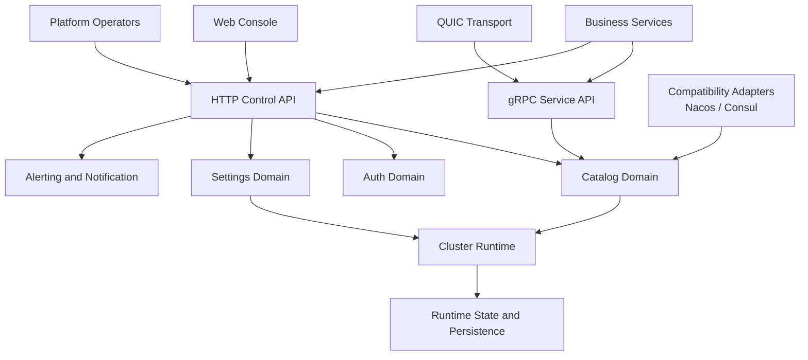

# Focalors

English | [中文](README-zh-CN.md)

Focalors is an enterprise service registry control plane. Its goal is narrow and explicit: replace Nacos and Consul in scenarios where the real requirement is service registry, discovery, health control, topology, and governance, not a JVM-centered platform or a broader service-networking stack.

It keeps the product boundary focused on the parts a registry must own for the long term:

- service registration and discovery
- health checks and lifecycle control
- dependency topology
- runtime governance
- `standalone`, `cluster + ap`, and `cluster + cp` operating modes
- persistent or in-memory switching for event and metrics storage

For Go services, the only recommended public integration surface is [`pkg/sdk`](./pkg/sdk). Nacos and Consul compatibility remain migration paths, not the long-term API boundary.

## Comparison

### Scope diagram



### Comparison matrix

| Dimension | Focalors | Nacos | Consul |
| --- | --- | --- | --- |
| Product scope | Registry control plane | Discovery, configuration, and service management platform | Service networking platform |
| Runtime dependency | Native Go process | Java runtime | Native binary |
| Official deployment starting point | Single process | Official quick start requires Java; source build path requires Maven | Official architecture centers on Server / Agent deployment |
| Official resource guidance | No JVM baseline requirement | Official docs recommend at least `2 CPU / 4 GB RAM / 60 GB Disk` | Official server sizing recommends `2x-4x` working set memory |
| Core capability boundary | Registry, discovery, health, topology, governance | Registry plus config and service management | Registry plus mesh, traffic management, gateways, automation |
| Consistency model | `standalone`, `cluster + ap`, `cluster + cp` | Standalone, cluster, multi-cluster deployment models | Raft-based control plane in a broader networking system |
| Storage strategy | Event and metrics storage can switch between persistence and memory | Built around Nacos storage model | Built around Catalog, KV, and Raft persistence |
| Go integration strategy | One recommended SDK: [`pkg/sdk`](./pkg/sdk) | Depends on Nacos client ecosystem | Multiple entry points such as HTTP API, DNS, agent, and mesh |
| Migration role | Native target, compatibility on the side | Common migration source | Common migration source |
| Commercial boundary | Core registry capability stays in the main product path | Depends on deployment and ecosystem choices | Official CE / Enterprise split |

### Why Focalors

- If the requirement is only a registry, Focalors removes the JVM baseline that Nacos still documents in its official quick start and deployment guidance.
- If the requirement is only a registry, Focalors stays narrower than Consul. Consul officially positions itself as a service networking solution, not only a registry.
- For Go teams, Focalors keeps the long-term integration boundary on one SDK, [`pkg/sdk`](./pkg/sdk), instead of leaving teams on Nacos naming semantics or Consul's broader agent, DNS, and HTTP surface.
- Focalors exposes native `AP` / `CP` switching. That lets one product serve both availability-first and consistency-first registry scenarios.
- Focalors exposes runtime switching for event and metrics storage, so local validation can stay light while production can keep persistence enabled.

## Core Capabilities

- Native service registration and discovery
- Health signaling and lifecycle control
- Dependency topology reporting
- HTTP API, gRPC API, and QUIC transport support
- `standalone`, `cluster + ap`, and `cluster + cp` runtime modes
- Runtime-switchable event and metrics storage modes
- Console authentication, API keys, RBAC-oriented management APIs
- Alerting and notification integration
- Nacos and Consul compatibility adapters for migration

## Architecture Overview



## Deployment Modes

| Mode | Best fit |
| --- | --- |
| `standalone + ap` | local development, isolated environments, fast validation |
| `cluster + ap` | enterprise environments that prioritize availability and operational flexibility |
| `cluster + cp` | enterprise environments that require stronger metadata consistency and explicit leader-based writes |

## Integration Strategy

### Recommended

- Go services integrate through [`pkg/sdk`](./pkg/sdk)

### Supported

- native HTTP API
- native gRPC API
- Nacos compatibility adapter
- Consul compatibility adapter

### Strategic direction

- use adapters to migrate
- use Focalors native APIs to standardize
- avoid making Nacos or Consul the long-term abstraction boundary

## Repository Layout

| Path | Responsibility |
| --- | --- |
| `cmd/server` | server bootstrap and runtime composition |
| `internal/catalog` | registration, discovery, lifecycle, topology |
| `internal/cluster` | AP / CP runtime and cluster behavior |
| `internal/transport/http` | native HTTP control APIs |
| `internal/transport/rpc` | gRPC service endpoints |
| `internal/transport/quic` | QUIC listener for RPC transport |
| `internal/adapter` | compatibility adapters, including Nacos and Consul |
| `internal/auth` | console auth, users, API keys |
| `internal/settings` | runtime settings and system controls |
| `internal/alert` | event evaluation and alert policy |
| `internal/notify` | notification delivery |
| `pkg/sdk` | the public Go SDK |
| `api/proto` | protobuf contracts |
| `examples` | integration and migration examples |
| `docs` | architecture, deployment, and integration documentation |

## Quick Start

Run the server:

```bash
go run ./cmd/server/main.go
```

Run with explicit config:

```bash
go run ./cmd/server/main.go -config configs/config.yaml.example
```

Default API address:

```text
http://127.0.0.1:8500
```

Run backend tests:

```bash
go test ./...
```

## Examples

- [Service discovery overview](./examples/service-discovery/README.md)
- [Native integration examples](./examples/service-discovery/native/README.md)
- [Consul migration examples](./examples/service-discovery/consul/README.md)
- [Nacos migration examples](./examples/service-discovery/nacos/README.md)
- [Custom protocol examples](./examples/service-discovery/custom/README.md)

## Documentation

- [Documentation index](./docs/README.md)
- [Architecture](./docs/architecture.md)
- [Deployment](./docs/deployment.md)
- [Integration](./docs/integration.md)
- [Simplified Chinese README](./README-zh-CN.md)

## External References

The comparison above is grounded in official product documentation plus the current repository boundary:

- Nacos quick start documents a Java runtime requirement and resource baseline: https://nacos.io/en/docs/next/quickstart/quick-start/
- Nacos deployment guidance recommends `2 CPU / 4 GB RAM` and above: https://nacos.io/en-us/docs/deployment.html
- Consul positions itself as service networking with discovery, mesh, traffic management, and automation: https://developer.hashicorp.com/consul/docs/intro
- Consul server resource guidance sizes memory at `2x-4x` working set: https://developer.hashicorp.com/consul/docs/reference/architecture/server
- Consul Community Edition vs Enterprise feature split: https://developer.hashicorp.com/consul/docs/fundamentals/editions

## 📄 License

This project is licensed under the Apache License 2.0. See the [LICENSE](LICENSE) file for details.
