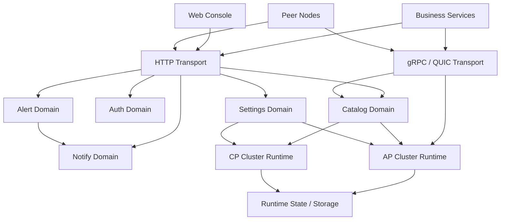

# Focalors Architecture

## System Role

Focalors is a service registry control plane for enterprise internal service networks. It focuses on four responsibilities:

- service registration and discovery
- health and lifecycle control
- topology visibility
- runtime governance

It serves three kinds of actors:

- business services that register, discover, subscribe, and heartbeat
- platform operators who need authentication, settings, alerts, and console APIs
- cluster nodes that must replicate or agree on registry state in `AP` or `CP` mode

## Logical Layers

## Repository Areas

| Area | Responsibility |
| --- | --- |
| `cmd/server` | process bootstrap and runtime composition |
| `internal/catalog` | registry, discovery, lifecycle, topology |
| `internal/cluster/ap` | AP replication and member coordination |
| `internal/cluster/cp` | CP consensus and state machine |
| `internal/transport/http` | HTTP control APIs |
| `internal/transport/rpc` | gRPC service APIs |
| `internal/transport/quic` | QUIC listener for RPC transport |
| `internal/auth` | login, users, API keys, RBAC-oriented control |
| `internal/settings` | runtime settings and system controls |
| `internal/alert` | event evaluation and alert policies |
| `internal/notify` | notification delivery |
| `pkg/sdk` | public Go SDK |
| `api/proto` | protobuf contracts |

## Runtime Modes

### Standalone

Use this for local development, isolated validation, and small demos.

### Cluster + AP

Use this when availability and operational flexibility matter more than strict metadata consistency.

### Cluster + CP

Use this when registry metadata must follow leader-based writes and stronger consistency rules.

## Protocol Responsibilities

| Protocol | Primary role |
| --- | --- |
| HTTP | console APIs, general management APIs, scriptable access |
| gRPC | main data plane, default SDK transport, streaming watch |
| QUIC | transport alternative for gRPC in constrained networks |
| Raft TCP | internal consensus traffic in `cluster + cp` |

Key decisions:

- QUIC is not a separate business protocol.
- HTTP remains the widest access surface, but not the preferred data plane for Go services.
- The recommended public programming boundary is `pkg/sdk`.

## Data Flow

### Registry Writes

1. A client sends a register request through SDK, HTTP, or gRPC.
2. The transport layer forwards the request to `catalog`.
3. `catalog` routes the write through AP replication or CP consensus.
4. The updated state triggers watch notifications and follow-up runtime actions.

### Service Discovery

1. A client queries by service name.
2. `catalog` filters by namespace, datacenter, and health state.
3. The server returns the matching instance set.

### Subscription

1. gRPC uses `Watch` as the primary subscription model.
2. HTTP falls back to polling semantics.
3. The SDK computes deltas and invokes callbacks on change.

## Public API Strategy

Focalors keeps one recommended Go entry point:

- `pkg/sdk`

HTTP and gRPC remain supported protocol surfaces. Nacos and Consul adapters remain migration tools, not the long-term product boundary.

## Related Reading

- [Deployment](./deployment.md)
- [Integration](./integration.md)
- [Simplified Chinese architecture](./architecture_zh-CN.md)
