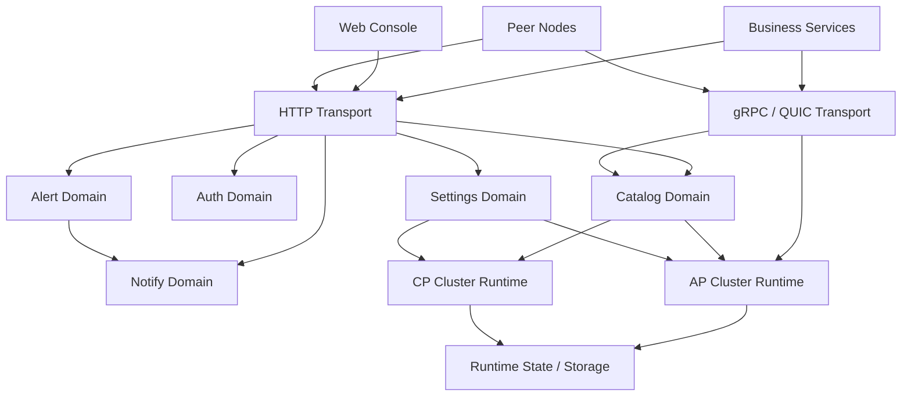

# Focalors Architecture

## System Role

Focalors is a service registry control plane for enterprise internal service networks. It focuses on four responsibilities:

- service registration and discovery
- health and lifecycle control
- topology visibility
- runtime governance

It serves three kinds of actors:

- business services that register, discover, subscribe, and heartbeat
- platform operators who need authentication, settings, alerts, and console APIs
- cluster nodes that must replicate or agree on registry state in `AP` or `CP` mode

## Logical Layers

```mermaid
graph TB
    Client[Business Services]
    Console[Web Console]
    Peer[Peer Nodes]

    HTTP[HTTP Transport]
    GRPC[gRPC / QUIC Transport]

    Catalog[Catalog Domain]
    Auth[Auth Domain]
    Settings[Settings Domain]
    Alert[Alert Domain]
    Notify[Notify Domain]

    AP[AP Cluster Runtime]
    CP[CP Cluster Runtime]
    Store[Runtime State / Storage]

    Client --> HTTP
    Client --> GRPC
    Console --> HTTP
    Peer --> HTTP
    Peer --> GRPC

    HTTP --> Catalog
    HTTP --> Auth
    HTTP --> Settings
    HTTP --> Alert
    HTTP --> Notify

    GRPC --> Catalog
    GRPC --> AP

    Catalog --> AP
    Catalog --> CP
    Settings --> AP
    Settings --> CP
    Alert --> Notify
    AP --> Store
    CP --> Store
```

## Repository Areas

The repository is a Go workspace. Each control-plane domain has its own module and
may expose only `api`, `module`, `pkg`, or protocol packages to another module.

| Area | Module identity | Responsibility |
| --- | --- | --- |
| `apps/registry` | `eden-microservice/apps/registry` | registry, discovery, compatibility adapters, registry SDK |
| `apps/config` | `eden-microservice/apps/config` | configuration resources, history, watches, Nacos Config compatibility |
| `apps/gateway` | `eden-microservice/apps/gateway` | route definitions, publication, matching, and proxy runtime |
| `apps/auth` | `eden-microservice/apps/auth` | login, users, API keys, and RBAC |
| `apps/cluster` | `eden-microservice/apps/cluster` | AP replication, CP consensus, node and runtime governance |
| `apps/server` | `eden-microservice/apps/server` | aggregate process and unified HTTP/gRPC transports |
| `apps/ui` | — | Vue administration console |
| `packages` | `eden-microservice/packages` | repository-local shared foundations |

`apps/server/cmd/server` remains the default all-in-one deployment and owns its process
configuration under `apps/server/config`. Domain-owned commands under
`apps/<domain>/cmd/<domain>` are independent build boundaries.

## Runtime Modes

### Standalone

Applicable to local development, isolated validation, and small-scale demonstrations.

### Cluster + AP

Applicable to environments where availability and operational flexibility take precedence over strict metadata consistency.

### Cluster + CP

Applicable to environments where registry metadata must follow leader-based writes and stronger consistency constraints.

## Protocol Responsibilities

| Protocol | Primary role |
| --- | --- |
| HTTP | console APIs, general management APIs, scriptable access |
| gRPC | main data plane, default SDK transport, streaming watch |
| QUIC | transport alternative for gRPC in constrained networks |
| Raft TCP | internal consensus traffic in `cluster + cp` |

Key decisions:

- QUIC is not a separate business protocol.
- HTTP remains the widest access surface, but not the preferred data plane for Go services.
- The primary public programming boundary is `apps/registry/pkg/sdk`.

## Data Flow

### Registry Writes

1. A client sends a register request through SDK, HTTP, or gRPC.
2. The transport layer forwards the request to `catalog`.
3. `catalog` routes the write through AP replication or CP consensus.
4. The updated state triggers watch notifications and follow-up runtime actions.

### Service Discovery

1. A client queries by service name.
2. `catalog` filters by namespace, datacenter, and health state.
3. The server returns the matching instance set.

### Subscription

1. gRPC uses `Watch` as the primary subscription model.
2. HTTP falls back to polling semantics.
3. The SDK computes deltas and invokes callbacks on change.

## Public API Strategy

Focalors defines one primary Go entry point:

- `apps/registry/pkg/sdk`

HTTP and gRPC remain supported protocol surfaces. Nacos and Consul adapters remain migration tools, not the long-term product boundary.

## Related Reading

- [Deployment](./deployment.md)
- [Integration](./integration.md)
- [Simplified Chinese architecture](./architecture_zh-CN.md)
