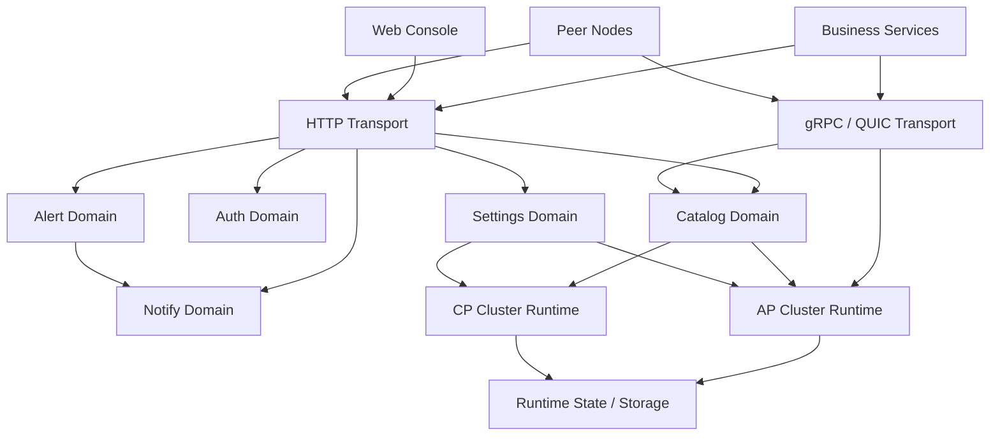

# 芙卡洛斯系统架构

## 1. 系统定位

芙卡洛斯是一个轻量级服务注册与发现控制平面。它服务于三个对象：

- 业务服务
  需要注册、发现、订阅和心跳续约。
- 平台与运维
  需要控制台、认证、配置、告警和通知能力。
- 集群节点
  需要在 AP 或 CP 模式下完成成员同步和状态复制。

从系统边界看，芙卡洛斯包含三层能力：

- 数据面
  处理注册、发现、心跳、订阅、拓扑上报。
- 控制面
  处理认证、权限、配置、节点管理、控制台 API。
- 复制与一致性层
  处理 AP 复制或 CP 共识。

## 2. 架构目标

- 提供统一的服务注册与发现模型
- 在 AP / CP 两种一致性模式间切换
- 对外统一推荐一个 Go SDK
- 同时保留 HTTP、gRPC 和兼容生态接入能力
- 在单进程部署中完成控制面与数据面的统一装配

## 3. 逻辑分层

## 4. 代码分区

按职责划分，仓库主要分为以下模块：

| 模块 | 职责 |
| --- | --- |
| `cmd/server` | 进程入口与运行时装配 |
| `internal/catalog` | 注册、发现、实例状态、拓扑核心领域 |
| `internal/cluster/ap` | AP 模式复制与节点协作 |
| `internal/cluster/cp` | CP 模式 Raft 共识与状态机 |
| `internal/transport/http` | HTTP API 出口 |
| `internal/transport/rpc` | gRPC 服务出口 |
| `internal/transport/quic` | QUIC 监听入口 |
| `internal/auth` | 登录、用户、API Key、RBAC |
| `internal/settings` | 运行时设置与系统配置 |
| `internal/alert` | 事件评估与告警规则 |
| `internal/notify` | 通知渠道与发送 |
| `pkg/sdk` | 对外唯一推荐的 Go SDK |
| `api/proto` | gRPC 协议定义 |

## 5. 运行模式

### 5.1 Standalone

单节点运行，适合：

- 本地开发
- 功能验证
- 小规模演示环境

特点：

- 系统复杂度最低
- 部署简单
- 不提供多节点容错

### 5.2 Cluster + AP

多节点高可用部署，适合：

- 对可用性更敏感
- 可以接受最终一致
- 需要较灵活扩缩容

特点：

- 通过复制和同步机制传播目录状态
- 对管理面和数据面都保持较好的可用性

### 5.3 Cluster + CP

多节点强一致部署，适合：

- 对注册元数据一致性要求高
- 需要明确的 Leader / Follower 角色

特点：

- 关键元数据写入通过 Raft 提交
- 集群管理复杂度高于 AP

## 6. 协议分工

| 协议 | 主要用途 |
| --- | --- |
| HTTP | 控制台 API、通用管理面、HTTP 客户端接入 |
| gRPC | 主数据面、官方 SDK 默认通信方式、节点间部分同步能力 |
| QUIC | 弱网场景下的 gRPC 传输补充 |
| Raft TCP | CP 模式内部共识链路 |

关键设计点：

- QUIC 不是独立业务协议，而是 gRPC 的传输补充。
- HTTP 是最通用的入口，但不是主推荐数据面。
- Go 业务优先通过 `pkg/sdk + grpc` 接入。

## 7. 关键数据流

### 7.1 注册写入

1. 客户端通过 SDK、HTTP 或 gRPC 发起注册。
2. 传输层将请求转交给 `catalog`。
3. `catalog` 根据当前运行模式决定写入路径：
   AP 模式走复制逻辑。
   CP 模式走共识提交流程。
4. 注册结果进入运行时状态，并触发后续订阅通知或事件联动。

### 7.2 服务发现

1. 客户端以服务名发起发现请求。
2. `catalog` 基于当前命名空间、数据中心、健康状态筛选实例。
3. 返回实例列表。
4. SDK 可选择把结果缓存到本地，以增强短时故障下的可用性。

### 7.3 服务订阅

1. gRPC 模式优先使用 `Watch` 流。
2. HTTP 模式退化为定时拉取。
3. SDK 对订阅变化计算快照差异，并触发回调。

## 8. 管理面架构

管理面统一走 HTTP：

- `/v1/auth/*`
- `/v1/settings/*`
- `/v1/cluster/*`
- `/v1/alert/*`
- `/v1/notify/*`

原因很直接：

- 控制台天然基于 HTTP。
- 认证、权限和配置变更需要更清晰的边界和更可观测的调用链路。
- 管理面比数据面更强调可审计性，而不是极致传输效率。

## 9. 对外 API 策略

芙卡洛斯当前明确的对外策略是：

- `pkg/` 下只保留 `pkg/sdk` 作为对外 Go API
- 协议接入仍然保留 HTTP 和 gRPC
- 兼容层存在，但不作为新项目的优先路径

这意味着：

- 对外编程模型应该尽量收敛
- 内部实现可以继续演进
- 文档和示例都应该围绕 `pkg/sdk` 建立主路径

## 10. 架构取舍

### 10.1 为什么不是拆成多个独立服务

因为当前系统优先解决的是“能运行、能接入、能治理”的完整闭环，而不是服务拆分本身。过早拆分会引入更多部署和一致性复杂度。

### 10.2 为什么既支持 AP 又支持 CP

因为注册中心在不同场景下对一致性的要求差异很大。把模式做成运行时选择，比维护两套产品更现实。

### 10.3 为什么推荐单一 SDK 出口

因为对外 API 越多，长期演进成本越高。SDK 只保留一个出口，才能让架构边界稳定。

## 11. 延伸阅读

- [部署与运行](./deployment_zh-CN.md)
- [接入与集成](./integration_zh-CN.md)

