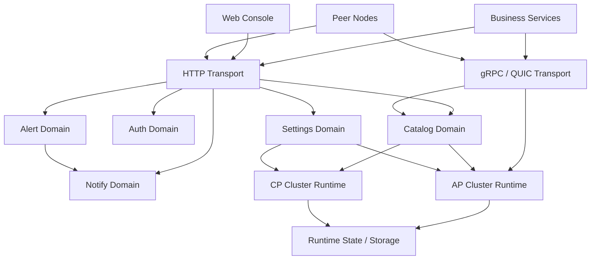

# 芙卡洛斯系统架构

## 系统定位

芙卡洛斯是一个轻量级服务注册与发现控制平面。它服务于三个对象：

- 业务服务
  需要注册、发现、订阅和心跳续约。
- 平台与运维
  需要控制台、认证、配置、告警和通知能力。
- 集群节点
  需要在 AP 或 CP 模式下完成成员同步和状态复制。

从系统边界看，芙卡洛斯包含三层能力：

- 数据面
  处理注册、发现、心跳、订阅、拓扑上报。
- 控制面
  处理认证、权限、配置、节点管理、控制台 API。
- 复制与一致性层
  处理 AP 复制或 CP 共识。

## 架构目标

- 提供统一的服务注册与发现模型
- 在 AP / CP 两种一致性模式间切换
- 对外统一提供一个 Go SDK 入口
- 同时保留 HTTP、gRPC 和兼容生态接入能力
- 在单进程部署中完成控制面与数据面的统一装配

## 逻辑分层

```mermaid
graph TB
    Client[Business Services]
    Console[Web Console]
    Peer[Peer Nodes]

    HTTP[HTTP Transport]
    GRPC[gRPC / QUIC Transport]

    Catalog[Catalog Domain]
    Auth[Auth Domain]
    Settings[Settings Domain]
    Alert[Alert Domain]
    Notify[Notify Domain]

    AP[AP Cluster Runtime]
    CP[CP Cluster Runtime]
    Store[Runtime State / Storage]

    Client --> HTTP
    Client --> GRPC
    Console --> HTTP
    Peer --> HTTP
    Peer --> GRPC

    HTTP --> Catalog
    HTTP --> Auth
    HTTP --> Settings
    HTTP --> Alert
    HTTP --> Notify

    GRPC --> Catalog
    GRPC --> AP

    Catalog --> AP
    Catalog --> CP
    Settings --> AP
    Settings --> CP
    Alert --> Notify
    AP --> Store
    CP --> Store
```

## 代码分区

仓库使用 Go workspace。每个控制面领域都是独立模块；跨模块只能依赖对方的
`api`、`module`、`pkg` 或协议包，不能引用其他模块的 `internal`。

| 目录 | 模块标识 | 职责 |
| --- | --- | --- |
| `apps/registry` | `eden-microservice/apps/registry` | 注册、发现、兼容适配器、注册中心 SDK |
| `apps/config` | `eden-microservice/apps/config` | 配置资源、历史、监听、Nacos Config 兼容 |
| `apps/gateway` | `eden-microservice/apps/gateway` | 路由定义、发布、匹配与代理运行时 |
| `apps/auth` | `eden-microservice/apps/auth` | 登录、用户、API Key、RBAC |
| `apps/cluster` | `eden-microservice/apps/cluster` | AP 复制、CP 共识、节点与运行时治理 |
| `apps/server` | `eden-microservice/apps/server` | 聚合进程与统一 HTTP/gRPC 传输层 |
| `apps/ui` | — | Vue 管理控制台 |
| `packages` | `eden-microservice/packages` | 仓库内共享基础包 |

默认部署入口仍是 `apps/server/cmd/server`，其进程配置归 `apps/server/config`。各领域的
`apps/<domain>/cmd/<domain>` 提供独立构建边界。

## 运行模式

### Standalone

单节点运行，适合：

- 本地开发
- 功能验证
- 小规模演示环境

特点：

- 系统复杂度最低
- 部署简单
- 不提供多节点容错

### Cluster + AP

多节点高可用部署，适合：

- 对可用性更敏感
- 可以接受最终一致
- 需要较灵活扩缩容

特点：

- 通过复制和同步机制传播目录状态
- 对管理面和数据面都保持较好的可用性

### Cluster + CP

多节点强一致部署，适合：

- 对注册元数据一致性要求高
- 需要明确的 Leader / Follower 角色

特点：

- 关键元数据写入通过 Raft 提交
- 集群管理复杂度高于 AP

## 协议分工

| 协议 | 主要用途 |
| --- | --- |
| HTTP | 控制台 API、通用管理面、HTTP 客户端接入 |
| gRPC | 主数据面、官方 SDK 默认通信方式、节点间部分同步能力 |
| QUIC | 弱网场景下的 gRPC 传输补充 |
| Raft TCP | CP 模式内部共识链路 |

关键设计点：

- QUIC 不是独立业务协议，而是 gRPC 的传输补充。
- HTTP 是最通用的入口，但不是主数据面。
- Go 业务优先通过 `apps/registry/pkg/sdk + grpc` 接入。

## 关键数据流

### 注册写入

1. 客户端通过 SDK、HTTP 或 gRPC 发起注册。
2. 传输层将请求转交给 `catalog`。
3. `catalog` 根据当前运行模式决定写入路径：
   AP 模式走复制逻辑。
   CP 模式走共识提交流程。
4. 注册结果进入运行时状态，并触发后续订阅通知或事件联动。

### 服务发现

1. 客户端以服务名发起发现请求。
2. `catalog` 基于当前命名空间、数据中心、健康状态筛选实例。
3. 返回实例列表。
4. SDK 可选择把结果缓存到本地，以增强短时故障下的可用性。

### 服务订阅

1. gRPC 模式优先使用 `Watch` 流。
2. HTTP 模式退化为定时拉取。
3. SDK 对订阅变化计算快照差异，并触发回调。

## 管理面架构

管理面统一走 HTTP：

- `/v1/auth/*`
- `/v1/settings/*`
- `/v1/cluster/*`
- `/v1/alert/*`
- `/v1/notify/*`

原因很直接：

- 控制台天然基于 HTTP。
- 认证、权限和配置变更需要更清晰的边界和更可观测的调用链路。
- 管理面比数据面更强调可审计性，而不是极致传输效率。

## 对外 API 策略

芙卡洛斯当前明确的对外策略是：

- 注册中心模块通过 `apps/registry/pkg/sdk` 提供对外 Go API
- 协议接入仍然保留 HTTP 和 gRPC
- 兼容层存在，但不作为新项目的优先路径

这意味着：

- 对外编程模型应该尽量收敛
- 内部实现可以继续演进
- 文档和示例都应该围绕 `apps/registry/pkg/sdk` 建立主路径

## 架构取舍

### 为什么独立模块仍保留聚合部署

模块边界解决代码所有权、依赖方向和独立构建问题；`apps/server` 保留默认聚合部署，
避免小规模环境必须承担多进程部署成本。需要独立部署时可从各领域命令入口继续演进。

### 为什么既支持 AP 又支持 CP

因为注册中心在不同场景下对一致性的要求差异很大。把模式做成运行时选择，比维护两套产品更现实。

### 单一 SDK 出口的设计原因

因为对外 API 越多，长期演进成本越高。SDK 只保留一个出口，才能让架构边界稳定。

## 延伸阅读

- [部署与运行](./deployment_zh-CN.md)
- [接入与集成](./integration_zh-CN.md)

