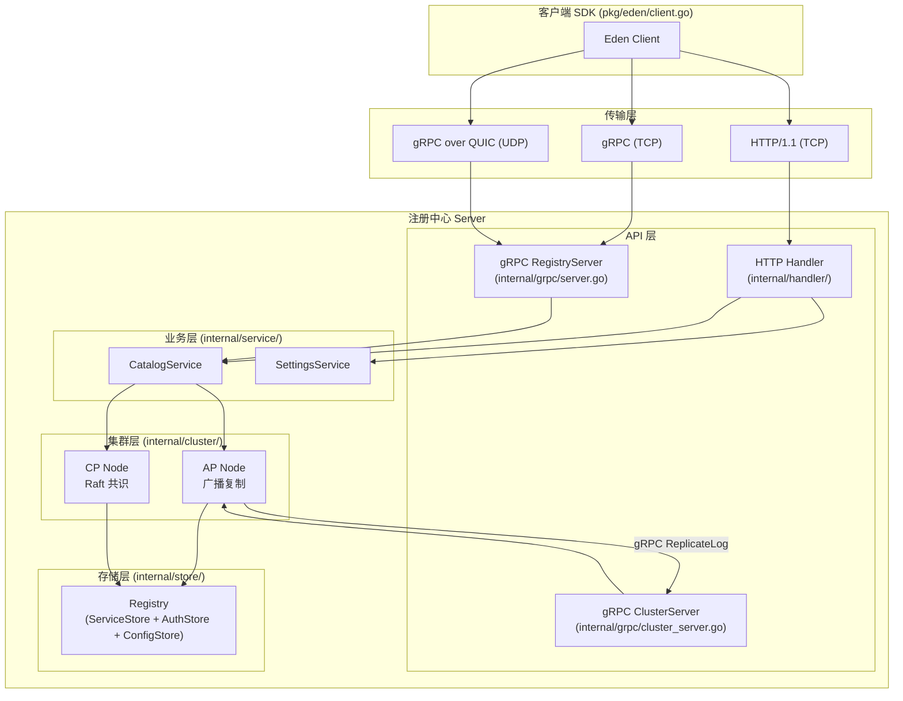
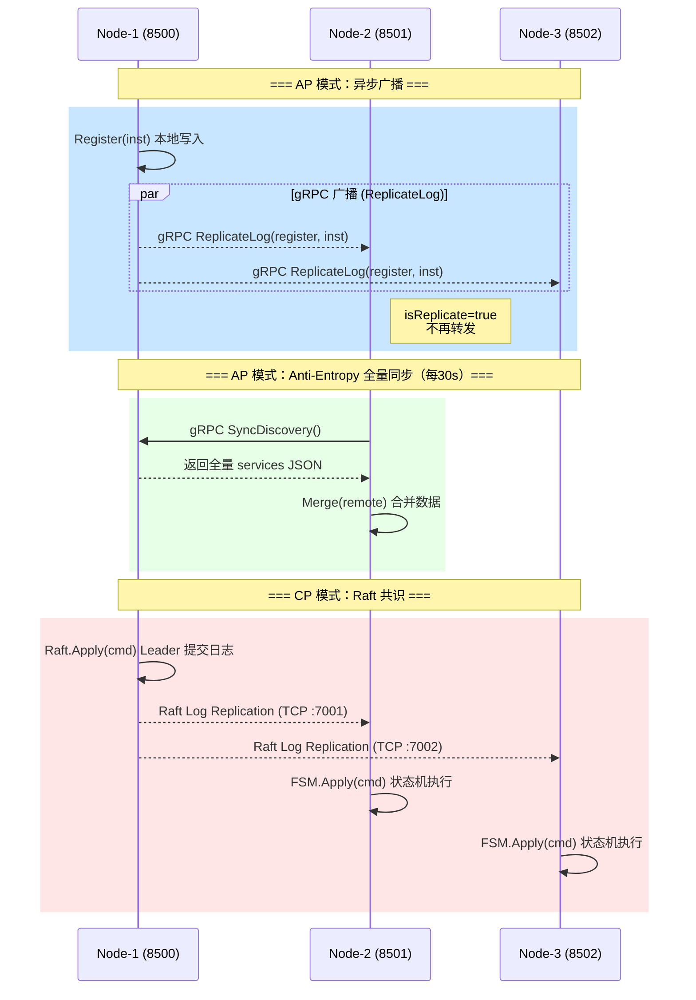
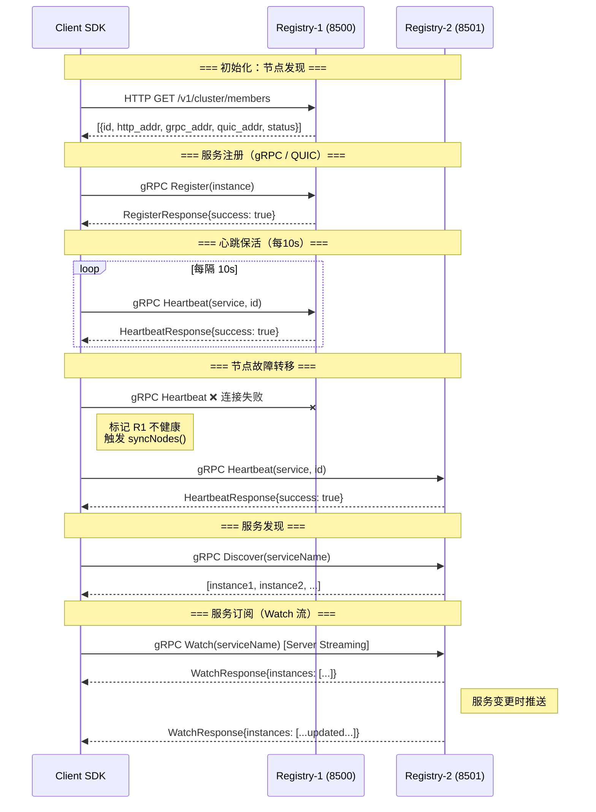

# Eden 通信协议架构

Eden 注册中心使用 4 种通信协议，服务于不同场景。本文档梳理各协议的用途、通信拓扑和关键代码路径。

## 1. 协议总览

| 协议 | 端口范围 | 用途 | 参与方 |
|------|---------|------|--------|
| **HTTP** | 8500-8599 | REST API（控制台 + SDK）+ 节点间内部同步 | 客户端 ↔ 注册中心，注册中心 ↔ 注册中心 |
| **gRPC** | 9000-9999 | 高性能服务注册/发现 + 节点间数据复制 | 客户端 ↔ 注册中心，注册中心 ↔ 注册中心 |
| **QUIC** | 10000-10999 | gRPC 的可选传输层（UDP），弱网优化 | 客户端 ↔ 注册中心 |
| **Raft** | 7000-7999 | CP 模式下的共识协议（Leader 选举 + 日志复制） | 注册中心 ↔ 注册中心（仅 CP 模式） |

## 2. 协议分层架构



## 3. 注册中心之间的通信



### 关键代码路径

**AP 广播路径**：
```
catalogService.Register()                   # internal/service/catalog.go:31
  → apNode.Apply("register", inst, false)   # internal/cluster/ap/node.go:103
    → Registry.Register(inst)               # 本地写入
    → go broadcast("register", data)        # 异步广播
      → PeerManager.Broadcast()             # internal/cluster/peer_manager.go:172
        → peer.GetClient()                  # 获取 gRPC 连接
        → client.ReplicateLog()             # 发送到对端
```

**CP Raft 路径**：
```
catalogService.Register()                   # internal/service/catalog.go:31
  → cpNode.Apply(cmd, 5s)                   # internal/cluster/cp/node.go:101
    → raft.Apply(data, timeout)             # 提交到 Raft 集群
    → FSM.Apply(log)                        # internal/cluster/cp/fsm.go:58
      → registry.Register(inst)            # 所有节点的 FSM 都执行
```

## 4. 客户端与注册中心的通信



## 5. 协议 → 文件映射

### HTTP 协议

| 文件 | 职责 |
|------|------|
| `internal/handler/handler.go` | 路由注册，CORS |
| `internal/handler/catalog_handler.go` | `/v1/catalog/*` 服务注册/注销/心跳/发现 |
| `internal/handler/cluster_handler.go` | `/v1/cluster/*` 集群成员管理，`/v1/node/info` 节点信息 |
| `internal/handler/settings_handler.go` | `/v1/settings/*` 配置管理 |
| `internal/handler/auth_handler.go` | `/v1/auth/*` 登录，JWT/RBAC/APIKey 中间件 |

> **特殊端点**：`/internal/sync/*` 路径用于节点间的 HTTP 内部同步（seeds、users、apikeys、settings），无鉴权。

### gRPC 协议

| 文件 | Proto 定义 | 职责 |
|------|-----------|------|
| `internal/grpc/server.go` | `api/proto/registry/v1/` | **RegistryService** — 客户端注册/注销/心跳/发现/Watch |
| `internal/grpc/cluster_server.go` | `api/proto/cluster/v1/` | **ClusterService** — 节点间数据复制(ReplicateLog)、全量同步(SyncDiscovery)、配置同步 |
| `internal/cluster/peer_manager.go` | — | gRPC 连接池管理，Broadcast 广播 |

### QUIC 协议

| 文件 | 职责 |
|------|------|
| `internal/grpc/quic_listener.go` | QUIC → net.Listener 适配器，供 gRPC Server 使用 |
| `pkg/eden/client.go` (dialQUIC) | SDK 侧 QUIC 拨号器，gRPC over QUIC 客户端 |
| `cmd/server/main.go` (L254-274) | 启动 QUIC gRPC Server，自签名 TLS 证书 |

> QUIC 运行在 UDP 上，复用同一个 gRPC Server（与 TCP gRPC 共享 RegistryService + ClusterService）。

### Raft 协议

| 文件 | 职责 |
|------|------|
| `internal/cluster/cp/node.go` | Raft 节点管理（创建、Join、Apply、Members） |
| `internal/cluster/cp/fsm.go` | Raft FSM 状态机（Apply 命令到 Registry） |
| `cmd/server/main.go` (L167-204) | Raft 初始化，Bootstrap，Join 到现有集群 |

> Raft 使用 `hashicorp/raft` 库，传输层为 TCP，日志存储使用 BoltDB。

## 6. 端口与服务对应

以 3 节点集群为例：

| 节点 | HTTP | gRPC | QUIC | Raft |
|------|------|------|------|------|
| node-1 | :8500 | :9000 | :10000 | :7000 |
| node-2 | :8501 | :9001 | :10001 | :7001 |
| node-3 | :8502 | :9002 | :10002 | :7002 |

## 7. AP vs CP 模式对比

| 维度 | AP 模式 | CP 模式 |
|------|---------|---------|
| **一致性** | 最终一致（秒级延迟） | 强一致（多数派确认） |
| **写入路径** | 本地写入 → 异步广播 | Leader Apply → Raft 复制 |
| **可用性** | 任意节点可写 | 仅 Leader 可写 |
| **节点间协议** | gRPC (ReplicateLog + SyncDiscovery) | Raft TCP (日志复制) |
| **故障影响** | 短暂数据不一致 | 少数派节点无法写入 |
| **适用场景** | 高可用优先 | 数据一致性优先 |
