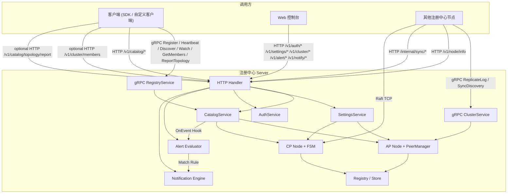

# Eden 架构文档

本文档描述 Eden 当前实现中的系统分层、通信协议、节点同步与控制台通信模型。本文档以当前仓库代码为准，不对尚未进入主路径的接口作扩展性推断。

## 1. 架构目标

Eden 的目标是提供一套可在 `AP` 与 `CP` 模式间切换的轻量级注册中心，同时覆盖三类能力：

- 面向业务服务的注册、心跳、发现、订阅与实例上下线。
- 面向运维治理的控制台、多语言 (i18n)、用户、RBAC、API Key 与系统运维配置。
- 面向集群的节点复制、反熵同步与强一致复制。
- 面向系统的事件响应体系：基于滑动窗口规则的自定义告警及多渠道系统通知 (Webhooks / SMTP)。

## 2. 协议总览

| 协议 | 默认入口 | 当前主要用途 | 主要参与方 |
|---|---|---|---|
| HTTP | `http_addr`，默认 `:8500` | 控制台管理 API、HTTP 客户端接入、可选 SDK 成员同步、节点元数据查询、内部配置同步 | 控制台 ↔ 注册中心，客户端 ↔ 注册中心，节点 ↔ 节点 |
| gRPC | `grpc_addr`，默认自动分配至 `9000-9999` | SDK 默认业务接入、自定义 gRPC 客户端、gRPC 节点发现、gRPC 拓扑上报、AP 模式节点复制 | 客户端 ↔ 注册中心，节点 ↔ 节点 |
| QUIC | `quic_addr`，默认自动分配至 `10000-10999` | gRPC 的可选传输层，主要用于客户端弱网接入 | 客户端 ↔ 注册中心 |
| Raft | `raft_addr`，建议 `127.0.0.1:7000+` | CP 模式 Leader 选举、日志复制、状态机提交 | 注册中心 ↔ 注册中心 |

说明：

- `QUIC` 不是独立业务协议，而是 gRPC 的可选传输层。
- 官方 SDK 默认业务协议为 `gRPC`，但是否同时使用 HTTP 控制面取决于传入地址形式与 `DiscoveryMode`。
- `grpc/quic + static` 模式可以做到客户端与注册中心之间完全不发生 HTTP 通信。
- `Transport=http` 可以做到客户端业务链路完全基于 HTTP。

## 3. 系统分层

服务端入口位于 `cmd/server/main.go`。启动时会统一初始化：

- `Registry` 存储层
- `AP Node`
- `CP Node`
- `CatalogService`、`AuthService`、`SettingsService`、`ClusterService`
- HTTP Server
- gRPC Server
- QUIC Listener

因此，当前实现不是两套独立二进制，而是同一进程里同时具备 AP 与 CP 能力，再按当前模式路由业务写入。

## 4. 客户端与注册中心通信

### 4.1 官方 SDK 纯 gRPC 模式

当 `pkg/eden` 使用直接 `grpc_addr` 并将 `Transport=grpc` 时，客户端与注册中心之间可以完全通过 gRPC 完成通信。

- `DiscoveryMode=auto` 时，注册、心跳、发现、订阅、节点发现、拓扑上报全部通过 `eden.registry.v1.RegistryService`
- 节点发现走 `GetMembers`
- 拓扑上报走 `ReportTopology`
- 不需要调用 `GET /v1/cluster/members`
- 不需要调用 `POST /v1/catalog/topology/report`
- 若将 `DiscoveryMode=static`，则关闭动态成员发现，仅在传入的 gRPC 地址集合内执行故障转移

### 4.2 官方 SDK 纯 HTTP 模式

当 `pkg/eden` 将 `Transport=http` 时：

- 注册走 `POST /v1/catalog/register`
- 心跳走 `POST /v1/catalog/heartbeat`
- 发现走 `GET /v1/catalog/service/{name}`
- 下线走 `POST /v1/catalog/instance/status`
- 订阅语义由 SDK 基于发现接口轮询实现
- 如启用动态成员同步或拓扑上报，会额外调用 `/v1/cluster/members` 与 `/v1/catalog/topology/report`

### 4.3 自定义客户端

当前支持两类正式入口：

- gRPC：直接调用 `eden.registry.v1.RegistryService`
- HTTP：直接调用 `/v1/catalog/*`

协议边界如下：

| 用途 | gRPC | HTTP |
|---|---|---|
| 注册实例 | `Register` | `POST /v1/catalog/register` |
| 心跳续约 | `Heartbeat` | `POST /v1/catalog/heartbeat` |
| 服务发现 | `Discover` | `GET /v1/catalog/service/{name}` |
| 实例上下线 | `SetInstanceStatus` / `Deregister` | `POST /v1/catalog/instance/status` |
| 实时订阅 | `Watch` | 无对等推流接口 |
| 节点发现 | `GetMembers` | `GET /v1/cluster/members` |
| 拓扑上报 | `ReportTopology` | `POST /v1/catalog/topology/report` |

说明：

- 自定义 gRPC 客户端现在可以通过 `GetMembers` 获取节点列表与传输地址信息。
- 若业务方不希望客户端动态维护节点列表，可将 SDK 或自定义客户端固定为静态节点列表。
- HTTP 方式没有与 `Watch` 对等的服务端推流接口；若需要订阅语义，应由客户端自行轮询发现接口。
- 依赖拓扑既可以通过 gRPC `ReportTopology` 主动上报，也可以在 gRPC `Discover` / `Watch` 中通过 metadata `x-consumer-service` 记录消费者关系。

## 5. 注册中心节点同步

### 5.1 AP 模式

AP 模式下的主链路如下：

| 目的 | 协议 | 入口 |
|---|---|---|
| 服务数据异步复制 | gRPC | `ClusterService.ReplicateLog` |
| 服务数据反熵同步 | gRPC | `ClusterService.SyncDiscovery` |
| 节点元数据查询 | HTTP | `GET /v1/node/info` |
| 种子同步 | HTTP | `POST /internal/sync/seeds` |
| 设置同步 | HTTP | `POST /internal/sync/settings` |

实现特点如下：

- 服务数据主链路使用 gRPC。
- 节点元数据与控制面同步使用 HTTP。
- `PeerManager` 维护的是节点 HTTP 入口；在建立节点间 gRPC 连接前，会先通过 `GET /v1/node/info` 获取对端的 gRPC 地址信息。

### 5.2 CP 模式

CP 模式下的主链路如下：

| 目的 | 协议 | 入口 |
|---|---|---|
| Leader 选举与日志复制 | Raft TCP | `raft_addr` |
| 集群加入 | HTTP | `POST /v1/cluster/join` |
| 成员管理 | HTTP | `/v1/cluster/member` |
| 节点信息查询 | HTTP | `GET /v1/node/info` |

因此，CP 模式并不是只有 Raft；HTTP 仍承担控制面与管理面职责。

### 5.3 当前实现边界

`api/proto/cluster/v1/cluster.proto` 中还定义了以下 RPC：

- `SyncUser`
- `DeleteUser`
- `SyncAPIKey`
- `DeleteAPIKey`
- `SyncSettings`
- `ForwardToLeader`

但在当前主路径中：

- 高频使用的是 `ReplicateLog` 与 `SyncDiscovery`
- `ForwardToLeader` 尚未实现

因此，协议定义中存在的 RPC 并不等同于当前运行时一定进入主链路。

## 6. 控制台与注册中心通信

控制台采用前后端分离方式运行：

- 前端开发地址默认是 `http://127.0.0.1:2019`
- 后端管理入口默认是 `http://127.0.0.1:8500`

控制台与注册中心之间全部通过 HTTP 管理接口通信，典型路径如下：

| 用途 | 路径 |
|---|---|
| 登录 | `/v1/auth/login` |
| 服务与实例查询 | `/v1/catalog/services`、`/v1/catalog/service/{name}` |
| 集群成员管理 | `/v1/cluster/members`、`/v1/cluster/member` |
| 系统设置 | `/v1/settings/system`、`/v1/settings/storage` |
| 用户与权限 | `/v1/rbac/*` |
| API Key 管理 | `/v1/settings/apikey*` |

控制台不是独立协议栈，本质上是前端页面对注册中心 HTTP API 的管理封装。

## 7. 协议与代码映射

| 协议或链路 | 关键文件 |
|---|---|
| 客户端 gRPC 接入 | `api/proto/registry/v1/registry.proto`、`internal/grpc/server.go` |
| 客户端 HTTP 接入 | `internal/handler/catalog_handler.go` |
| SDK 传输与故障转移 | `pkg/eden/client.go` |
| AP 节点复制 | `api/proto/cluster/v1/cluster.proto`、`internal/cluster/ap/node.go`、`internal/grpc/cluster_server.go` |
| 节点 HTTP 同步 | `internal/handler/cluster_handler.go`、`internal/service/settings.go` |
| CP 共识 | `internal/cluster/cp/node.go`、`internal/cluster/cp/fsm.go` |
| 告警评估与通知 | `internal/alert/evaluator.go`、`internal/notify/engine.go` |
| 控制台 i18n 逻辑 | `web/src/utils/i18n.ts`、`web/src/views/settings.vue` |
| 服务端监听入口 | `cmd/server/main.go` |

## 8. 实现约束

- 当前节点间主复制链路不使用 QUIC；QUIC 主要面向客户端接入。
- 当前 gRPC 业务入口未实现与 HTTP 对齐的 API Key / JWT 拦截器。
- 控制台、成员管理、系统设置等控制面能力当前全部基于 HTTP。
