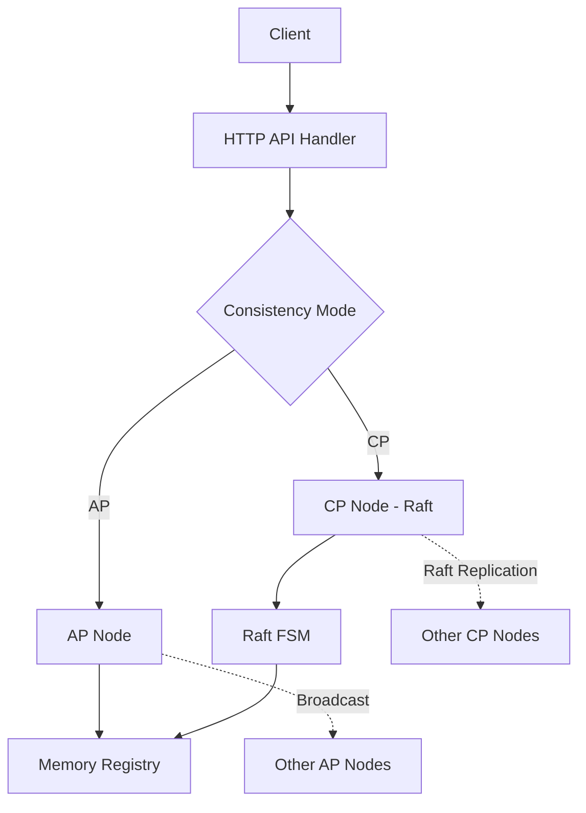

# Eden 注册中心设计文档

## 1. 架构目标
Eden 的设计目标是创建一个轻量、易用且具备强一致性/高可用性可切换能力的注册中心，能够作为 Consul 或 Nacos 的轻量替代方案。它支持在运行时动态切换一致性模式，以适应不同的业务场景。

## 2. 核心架构

Eden 采用分层设计，将 API 处理、集群管理和数据存储解耦：



### 2.1 存储模型 (Store)
- **内存存储**: 所有服务实例信息存储在 `internal/store/registry.go` 的 `Registry` 结构体中，通过 `map` 存储。
- **并发控制**: 使用 `sync.RWMutex` 保证线程安全。
- **持久化**: CP 模式下利用 Raft 的日志和快照机制；本地也会定期将 Settings 等关键配置持久化为 JSON。

### 2.2 集群组件 (internal/cluster)

该目录是集群逻辑的核心，分为 AP 和 CP 两种实现。

#### 2.2.1 AP 模式 (`internal/cluster/ap`)
AP 模式追求高可用性和分区容错性，采用简单高效的**广播同步机制**。

- **核心代码**: `node.go` 中的 `Apply` 和 `broadcast` 方法。
- **同步逻辑**: 
  1. 节点接收到注册请求后，首先在本地执行。
  2. 若该请求不是来自其他节点的同步（`replicate=false`），则异步启动广播。
  3. 通过 `peerMap` 遍历所有配置的 Seed 节点，发起 HTTP POST 同步请求。
- **防环机制**: 请求携带 `replicate=true` 参数。节点收到此类请求后不再二次广播。

```go
// internal/cluster/ap/node.go 部分代码
func (n *Node) Apply(cmdType string, data interface{}, isReplicate bool) error {
	// 1. 本地执行 (Registry 调用)
	// ... (代码省略)

	// 2. 如果不是同步请求，则广播给其他节点
	if !isReplicate {
		go n.broadcast(cmdType, data)
	}
	return nil
}
```

#### 2.2.2 CP 模式 (`internal/cluster/cp`)
CP 模式追求强一致性，基于典型的 **Raft 共识协议** (使用 `hashicorp/raft` 库)。

- **核心代码**: 
  - `node.go`: Raft 节点的生命周期管理（启动、加入、申请提案）。
  - `fsm.go`: 实现 Raft 的状态机协议。
- **同步逻辑**:
  1. 只有 Leader 节点可以接收 `Apply` 请求（写操作）。
  2. Leader 将请求作为 Log Entry 复制到多数派（Quorum）节点。
  3. 一旦日志被 Commit，各节点的 `FSM.Apply` 方法会被触发。
  4. FSM 将操作应用到内存 `Registry` 中。
- **快照机制**: 支持 `fsmSnapshot`，将内存中的所有服务数据定期全量持久化，防止 Raft 日志无限增长。

```go
// internal/cluster/cp/fsm.go 部分代码
func (f *FSM) Apply(l *hraft.Log) interface{} {
    var cmd Command
    json.Unmarshal(l.Data, &cmd) // 解析 Raft 日志中的指令
    
    switch cmd.Type {
    case CmdRegister:
        f.registry.Register(cmd.Instance) // 状态机应用到注册中心
    // ...
    }
    return nil
}
```

### 2.3 健康检查机制
- **主动/被动结合**: 客户端主动发送心跳（Heartbeat），服务端后台协程（Health Checker）定期扫描。
- **状态流转**: 
  - `passing` (健康): 正常服务。
  - `critical` (异常): 超过 TTL（默认 30s）未收到心跳。
  - `removed`: 长期（如超过 3 次检查）处于 `critical` 状态后自动剔除。

## 3. 接口规范
统一采用 RESTful 风格，主要接口分类如下：

| 功能 | 路径 | 方法 | 说明 |
| :--- | :--- | :--- | :--- |
| **服务管理** | `/v1/catalog/register` | `POST` | 注册实例 |
| | `/v1/catalog/heartbeat` | `POST` | 心跳续约 |
| | `/v1/catalog/services` | `GET` | 列出所有服务 |
| **集群管理** | `/v1/cluster/members` | `GET` | 查看集群成员 |
| | `/v1/cluster/stats` | `GET` | 查看集群元数据/统计 |
| **内部通信** | `/v1/catalog/register?replicate=true` | `POST` | AP 模式内部同步 |
| | `/v1/cluster/join` | `POST` | CP 模式节点加入请求 |

## 4. 技术栈
- **后端**: Go 1.21+, 标准库 `net/http` (Handler), `hashicorp/raft` (共识协议), `bolt` (本地日志存储)。
- **前端**: Vue 3 (Composition API), Vite, Element Plus, ECharts (监控图表)。
- **部署**: 低内存占用，支持单机模式或多节点集群部署。
