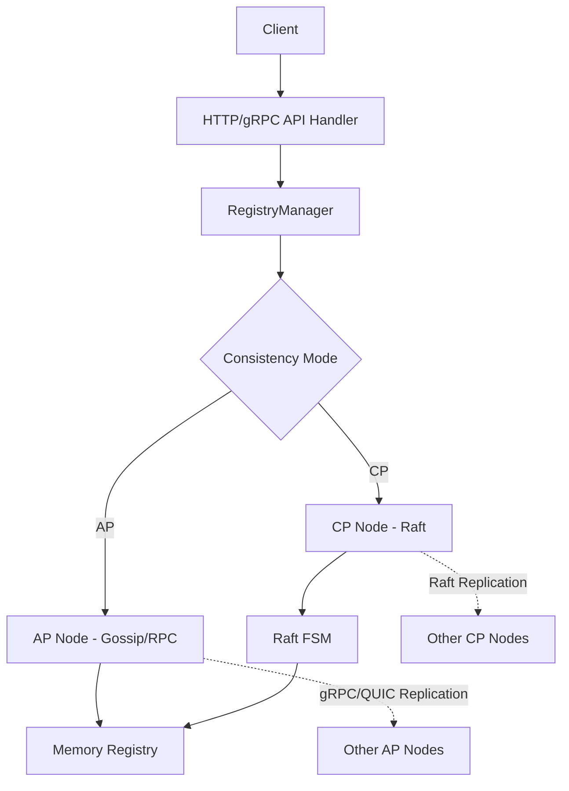

# Eden 注册中心设计文档

## 1. 架构目标
Eden 的设计目标是创建一个轻量、易用且具备强一致性/高可用性可切换能力的注册中心，能够作为 Consul 或 Nacos 的轻量替代方案。它支持在运行时动态切换一致性模式，以适应不同的业务场景。

## 2. 核心架构

Eden 采用分层设计，通过 `RegistryManager` 统一协调 API 处理、集群管理和数据存储：

### 2.1 业务协调层 (RegistryManager)
`RegistryManager` 是 Eden 的核心组件，它封装了所有的业务逻辑，并根据当前的运行模式（AP 或 CP）将操作路由到相应的集群节点：

- **屏蔽模式差异**: Handlers 无需关心当前是单机、AP 还是 CP 模式。
- **配置热更新**: 支持动态修改日志级别、服务治理策略等。
- **安全校验**: 统一处理 API Key 验证和用户权限检查。

### 2.2 存储模型 (Store)
- **内存存储**: 所有服务实例信息存储在 `internal/store` 的 `Registry` 结构体中。
- **并发控制**: 使用 `sync.RWMutex` 保证高性能并发访问。
- **持久化**: 
  - **快照**: CP 模式下利用 Raft 的日志和快照（Snapshot）机制。
  - **本地文件**: Settings、Users、Nodes 等关键数据实时持久化到 `data/` 目录下的 JSON 文件。

### 2.3 集群组件 (internal/cluster)

#### 2.3.1 AP 模式 (Availability & Partition Tolerance)
AP 模式追求极高的可用性，采用**主动同步机制**。

- **核心逻辑**: 节点接收到写操作后，本地执行成功即返回，随后通过 gRPC 异步广播给其他节点。
- **传输层**: 支持标准 TCP 和高性能 **QUIC** 协议，在弱网环境下具备更好的表现。
- **节点发现**: 初始通过 `configs/config.yaml` 或 `nodes.json` 加载种子节点，之后通过同步机制感知新成员。

#### 2.3.2 CP 模式 (Consistency & Partition Tolerance)
CP 模式基于 **Raft 共识协议** (使用 `hashicorp/raft`)。

- **强一致性**: 只有 Leader 响应写请求，确保所有节点数据绝对同步。
- **状态机 (FSM)**: 实现 Raft 的应用逻辑，将 Committed Log 应用到内存存储。
- **故障转移**: 自动选举 Leader，确保在多数节点存活时系统持续可用。

### 2.4 传输协议
Eden 拥有丰富的通信手段：
- **REST API**: 面向控制台和多语言客户端。
- **gRPC**: 节点间内部通信（Heartbeat, Sync）。
- **QUIC**: 可选的 gRPC 底层传输，提供 0-RTT 握手和更强的抗丢包能力。

## 3. 安全架构
- **用户认证**: 使用 **Bcrypt** 对用户密码进行强哈希存储，拒绝明文传输。
- **API 鉴权**: 所有的服务注册/注销操作通过 API Key 保护。
- **JWT**: 管理后台访问采用 JWT Token，支持 RBAC（Admin/Viewer）。

## 4. 扩展性设计 (Registry Adapters)
`pkg/registry` 提供了统一的注册中心接口，支持多种适配器：
- **Eden Adapter**: 原生支持高性能同步。
- **Consul/Nacos Adapter**: 允许现有微服务平滑迁移，实现零代码侵入。
- **工厂模式**: 通过简单的配置即可切换不同的注册中心实现。

## 5. 技术栈
- **后端**: Go 1.21+, `net/http`, `hashicorp/raft`, `quic-go`, `grpc-go`.
- **存储**: BoltDB (Raft Log), In-memory (Registry).
- **前端**: Vue 3, Vite, Element Plus, ECharts.
